# SparkSQL

# 目录

- [定义](#定义) 
  - [SparkSQL&SparkCore](#SparkSQL&SparkCore)
  - [SparkSQL&Hive](#SparkSQL&Hive)
- [SparkSQL的编程对象](#SparkSQL的编程对象)
  - [DataFrame概述](#DataFrame概述)
  - [DataFrame&RDD](#DataFrame&RDD)
  - [DataSet概述](#DataSet概述)
  - [DataSet&DataFrame](#DataSet&DataFrame)
  - [DataSet&DataFrame&RDD](#DataSet&DataFrame&RDD)
- [SparkSQL编程](#SparkSQL编程)
  - [核心API](#核心API)
  - [SparkSession的创建](#SparkSession的创建)
  - [DataFrame](#DataFrame)
    - [创建](#创建)
    - [Row](#Row)
      - [StructType](#StructType)
      - [DataType](#DataType)
    - [Encoder](#Encoder)
      - [NoEncoderfound](#NoEncoderfound)
      - [最简单的解决方案](#最简单的解决方案)
    - [Column](#Column)
      - [创建Column](#创建Column)
      - [创建TypedColumn](#创建TypedColumn)
      - [API](#API)
    - [Functions](#Functions)
      - [排序函数sort_funcs](#排序函数sort_funcs)
      - [聚合函数agg_funcs](#聚合函数agg_funcs)
      - [窗口函数window_funcs](#窗口函数window_funcs)
      - [普通函数normal_funcs](#普通函数normal_funcs)
      - [数学函数math_funcs](#数学函数math_funcs)
      - [加密函数misc_funcs](#加密函数misc_funcs)
      - [字符串函数string_funcs](#字符串函数string_funcs)
      - [时间函数datetime_funcs](#时间函数datetime_funcs)
      - [集合函数collection_funcs](#集合函数collection_funcs)
      - [自定义函数udf_funcs](#自定义函数udf_funcs)
    - [RDD转换为DataFrame](#RDD转换为DataFrame)
    - [DataFrame转换为RDD](#DataFrame转换为RDD)
  - [StatFunctions](#StatFunctions)
  - [DataSet](#DataSet)
    - [创建](#创建)
    - [RDD转换为DataSet](#RDD转换为DataSet)
    - [DataSet转换为RDD](#DataSet转换为RDD)
  - [DataFrame与DataSet互换](#DataFrame与DataSet互换)
    - [DataFrame转DataSet](#DataFrame转DataSet)
    - [DataSet转换为DataFrame](#DataSet转换为DataFrame)
  - [DataSetAPI](#DataSetAPI)
    - [Transaction](#Transaction)
      - [基本转换](#基本转换)
      - [强类型转换](#强类型转换)
      - [弱类型转换](#弱类型转换)
    - [Action](#Action)
  - [DSL语言风格](#DSL语言风格)
  - [SQL语言风格](#SQL语言风格)
  - [SparkSQL自定义函数](#SparkSQL自定义函数)
    - [UDF](#UDF)
    - [UDAF](#UDAF)
  - [开窗函数](#开窗函数)
- [调优](#调优)
  - [广播](#广播)
- [一条SQL的Spark之旅](#一条SQL的Spark之旅)
  - [SqlParser](#SqlParser)
  - [Analyzer](#Analyzer)
  - [Optimizer](#Optimizer)
    - [谓词下推](#谓词下推)
    - [列剪裁](#列剪裁)
    - [常量替换](#常量替换)
    - [常量累加](#常量累加)
  - [SparkPlanner](#SparkPlanner)
  - [WholeStageCodegen](#WholeStageCodegen)
- [SparkSql源码分析](#SparkSql源码分析)
  - [Catalyst架构分析](#Catalyst架构分析)
  - [Sql执行流程简图](#Sql执行流程简图)
  - [TreeNode](#TreeNode)
  - [LogicalPlan](#LogicalPlan)
  - [QueryExecution源码](#QueryExecution源码)
  - [SqlParser源码](#SqlParser源码)
  - [Analyzer源码](#Analyzer源码)
  - [Optimizer源码](#Optimizer源码)
  - [SparkPlanner源码](#SparkPlanner源码)
  - [WholeStageCodegen源码](#WholeStageCodegen源码)
- [数据源](#数据源)
  - [1.本地/HDFS文件](#1.本地/HDFS文件)
  - [2.关系型数据库](#2.关系型数据库)
  - [3.hive数据仓库](#3.hive数据仓库)


## 定义

SparkSQL是Spark用来处理结构化数据的一个模块，它提供了2个编程抽象：DataFrame和DataSet

### SparkSQL&SparkCore

- 对于SparkCore而言，RDD看做是对数据的封装(抽象)，对数据的进行操作需要先转换成RDD，对RDD可以使用各种算子进行处理,最终对数据进行统一的操作
- 对于SparkSQL而言，对数据进行操作的也需要进行转换，这里提供了两个新的抽象，分别是DataFrame和DataSet

### SparkSQL&Hive

- Hive是使用SQL的语法实现MapReduce
- SparkSQL是使用SQL的语法操作SparkCore的RDD

SparkSQL只能对表进行查询操作，无法增删改


## SparkSQL的编程对象

### DataFrame概述

DataFrame定义：也是一个分布式数据容器，同时还记录着表结构信息。简单地说，DataFrame 是 RDD 与 Schema 的集合

Schema定义：数据结构信息。例如MySQL数据库的组织和结构模式中包含了schema对象，Spark通过Schema就能够读懂数据, 因此在通信和IO时就只需要序列化和反序列化数据, 而结构的部分就可以省略了。

DataFrame属于弱类型，可以封装成row

off-heap : Spark能够以二进制的形式序列化数据(不包括结构)到off-heap中, 当要操作数据时, 就直接操作off-heap内存。

### DataFrame&RDD


1. 上图直观地体现了DataFrame和RDD的区别。左侧的RDD[Person]虽然以Person为类型参数，但Spark框架本身不了解Person类的内部结构。而右侧的DataFrame却提供了详细的结构信息，使得Spark SQL可以清楚地知道该数据集中包含哪些列，每列的名称和类型各是什么。DataFrame是为数据提供了Schema的视图。可以把它当做数据库中的一张表来对待，DataFrame也是懒执行的。
2. 性能上比RDD要高，主要原因：SparkSQL的**查询优化器**会将逻辑计划进行优化，最终执行的是效率更高的物理计划


### DataSet概述

定义：是Dataframe API的一个扩展，是Spark最新的数据抽象

DataFrame每一个行对应了一个Row。而Dataset的定义更加宽松，每一个record对应了一个任意的类型。DataFrame只是Dataset的一种特例。

**DataSet创立需要一个显式的Encoder，把对象序列化为二进制**

样例类被用来在Dataset中定义数据的结构信息，样例类中每个属性的名称直接映射到DataSet中的字段名称。

### DataSet&DataFrame 

1. Dataframe是Dataset的特列，DataFrame=Dataset[Row]，所以可以通过as方法将Dataframe转换为Dataset。其中，Row是一种类型，跟Car、Person这些的类型一样，所有的表结构信息我们都用Row来表示。
2. DataSet是强类型的。比如可以有Dataset[Car]，Dataset[Person]。
3. **DataFrame只是知道字段，但是不知道字段的类型**，所以在执行这些操作的时候是没办法在编译的时候检查是否类型失败的，比如你可以对一个String进行减法操作，在执行的时候才报错，而DataSet不仅仅知道字段，而且知道字段类型，所以有更严格的错误检查。

```scala
    ds.map(line => {
      val name: String = line.name  //在编译时就知道字段的类型
      val age: Int = line.age
      (name, age)
    }).show()

    df.map(line => {
      val name: Nothing = line.getAs("name")  //在编译时不知道字段的类型
      val age: Nothing = line.getAs("age")
      (name, age)
    }).show()  //报错
```


### DataSet&DataFrame&RDD

共性：

1. 都是弹性分布式数据集
2. 都可以理解成集合
3. 都有惰性机制，只有action算子才会触发代码执行
4. 三者有许多共同的函数，如filter，排序等

| 编程对象  | 优点                                                         | 缺点                                                         |
| --------- | ------------------------------------------------------------ | ------------------------------------------------------------ |
| RDD       | 1. 编译时类型安全，编译时能检查出类型是否正确。2. 面向对象风格，直接通过类名点属性操作数据 | 1. 序列化和反序列化性能开销，无论是集群间的通信还是IO操作，都需要对对象的结构和数据进行序列化和反序列化。2. GC的性能开销，频繁地创建销毁对象，会增加GC |
| DataFrame | 能够以二进制的形式序列化数据(不包括结构)到off-heap中，并且具有schema，所以可以不受JVM限制，不受GC困扰；不需要反序列化就可以执行sorting、shuffle等操作 | 编译时不会进行类型安全检查， API也不是面向对象风格的。       |
| DataSet   | 编译时进行类型安全检查。2. 不受GC困扰。3.不需要反序列化就可以执行sorting、shuffle等操作 |                                                              |


## SparkSQL编程

首先要在 pom.xml 文件中添加相关的依赖

```xml
<dependency>
    <groupId>org.apache.spark</groupId>
    <artifactId>spark-sql_2.11</artifactId>
    <version>${spark.version}</version>
</dependency>
```

### 核心API


### SparkSession的创建

```scala
    //第一种方式
    val spark: SparkSession = SparkSession
      .builder() //构建SparkSession对象
      .appName("SparkSessionDemo") //配置app名称
      .master("local") //配置运行模式
      .getOrCreate()  //开始创建初始化对象
```

```scala
    //第二种方式
    val spark: SparkSession = SparkSession
      .builder()
      .appName("SparkSessionDemo")
      .master("local")
      .enableHiveSupport()  //用于启用hive支持
      .getOrCreate()
```

```Scala
    //第三种方式
    val conf = new SparkConf()
    conf.setAppName("SparkSessionDemo").setMaster("local")

    val spark: SparkSession = SparkSession
      .builder()
      .config(conf)
      .getOrCreate()
```


### DataFrame

#### 创建

从数据文件中创建。从sparkSession中使用read方法创建

```scala
scala> spark.read.
csv   format   jdbc   json   load   option   options   orc   parquet   schema   table   text   textFile

val people = spark.read.parquet("...")
```

#### Row

`Row`类型是DataFrame中的一行，是一个`StructType`

可以用模式匹配来匹配Row中的字段，以此简化代码

```scala
    val oldDF = Seq[(Integer,String,Option[Int])](
      (1, "zhang", Some(18)),
      (2, null, Some(19)),
      (3, "li", null),
      (4, "luo", Some(28))
    ).toDF("Id", "Name", "Age")

    val value: RDD[String] = oldDF
      .na.drop()
      .rdd
      .map { case Row(id: Int, name: String, age: Int) =>
      s"id: $id, name: $name, age: $age"
    }
    value.foreach(println(_))

/**
 * id: 1, name: zhang, age: 18
 * id: 4, name: luo, age: 28 
 */
```


##### StructType

定义：Row/DataFrame的schema。是StructField的集合

```scala
case class StructType(fields: Array[StructField]) extends DataType with Seq[StructField] {
  ...
}

case class StructField(
    name: String,
    dataType: DataType,
    nullable: Boolean = true,
    metadata: Metadata = Metadata.empty) {
...
}
```

##### DataType

Spark sql 中所有数据类型的基本类型


#### Encoder

DataSet是一个Encoder的分布式数据集，即已序列化的结构数据

创建DataSet需要一个显示的Encoder，把对象序列化成二进制

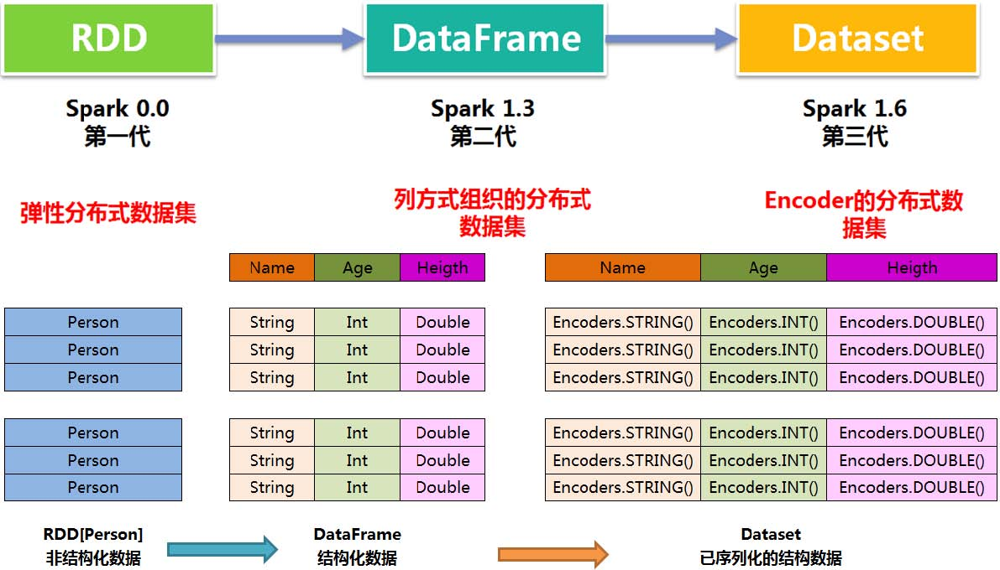

Spark 2.2 加入了内置 `encoder`，用于支持 `Seq`,`Array`, `etc`类型。如果只使用 `case class`和常用的scala类型来创建类型，只需要引入 `sparkSession.implicits._`

在spark 2.0中，对用户自定义类的 `encoder`还没有很好的支持，

当创建数据集时，spark需要一个编码器 `encoder`，用于将T类型的JVM对象与内部Spark SQL表示形式相互转换。

```scala
case class SimpleTuple(id: Int, desc: String)

val dataList = List(
  SimpleTuple(5, "abc"),
  SimpleTuple(6, "bcd")
)
val dataset = sparkSession.createDataset(dataList) // 报错：No implicits found
```

`encoder`的形式是`Encoder[T]`，`T`是要编码的数据类型。创建方式：

1. （推荐）通过`SparkSession`的`implicits`创建

```scala
import sparkSession.implicits._
```

2. 通过调用`Encoders`的静态方法显示创建.

```scala
val dataset = sparkSession.createDataset(dataList)(Encoders.product[SimpleTuple])
```

##### NoEncoderfound

但是`SparkSession`的`implicits`对常规的类没有编码器可用：

```scala
class MyObj(val i: Int)

import spark.implicits._
val d = spark.createDataset(Seq(new MyObj(1),new MyObj(2),new MyObj(3)))
```

编译报错：

`Unable to find encoder for type stored in a Dataset. Primitive types (Int, String, etc) and Product types (case classes) are supported by importing sqlContext.implicits._ Support for serializing other types will be added in future releases`

根据错误提示，可以`importing sqlContext.implicits._`来支持原始数据类型（`Int, String, etc`）以及继承了`Product`的数据类型（`case class, tuple`）的序列化

但是，如果将任何您刚用来获取上述错误的类型包装在某个继承`Product`的类中，则该错误会令人困惑地延迟到运行时报错：

```scala
import spark.implicits._
case class Wrap[T](unwrap: T)
class MyObj(val i: Int)
// ...
val d = spark.createDataset(Seq(Wrap(new MyObj(1)),Wrap(new MyObj(2)),Wrap(new MyObj(3)))) // 用样例类Wrap包装常规类MyObj
```

编译正常，运行报错：

`Exception in thread "main" java.lang.UnsupportedOperationException: No Encoder found for com.dataframe.MyObj`

原因：Spark在编译时检查的都是最外层的继承了`Product`的类（所有case class都会继承`Product`），并且仅在运行时才意识到它仍然不知道要怎么处理`MyObj`（如果尝试创建`Dataset[(Int,MyObj)]`，也会出现同样的问题）。这些是迫切需要解决的核心问题：

- 没有办法传递用于嵌套类型的自定义编码器（我没有办法为Spark提供编码器，`MyObj`以便它随后知道如何编码`Wrap[MyObj]`或`(Int,MyObj)`）

如果非要使用自定义常规类，解决方案：

1. 非嵌套自定义常规类，使用`kryo`编码器：

```scala
class MyObj(val i: Int)

implicit def single[A](implicit c: ClassTag[A]): Encoder[A] = Encoders.kryo[A](c)
val d1 = spark.createDataset(Seq(new MyObj(1),new MyObj(2),new MyObj(3)))
d1.printSchema()

root
 |-- value: binary (nullable = true)
```

2. 嵌套中的自定义常规类

```scala
class MyObj(val i: Int)

implicit def single[A](implicit c: ClassTag[A]): Encoder[A] = Encoders.kryo[A](c)
implicit def tuple2[A1, A2](
                             implicit e1: Encoder[A1],
                             e2: Encoder[A2]
                           ): Encoder[(A1,A2)] = Encoders.tuple[A1,A2](e1, e2)

val d1 = spark.createDataset(Seq(new MyObj(1),new MyObj(2),new MyObj(3)))
val d2 = d1.map(d => (d.i+1,d)).alias("d2")
d2.printSchema()

root
 |-- value: integer (nullable = true)
 |-- _2: binary (nullable = true)
```

一般类的解决方案：

```scala
class MyObj(val i: Int, val u: java.util.UUID, val s: Set[String])

import spark.implicits._
implicit def single[A](implicit c: ClassTag[A]): Encoder[A] = Encoders.kryo[A](c)

implicit def tuple3[A1, A2, A3](
                                 implicit e1: Encoder[A1],
                                 e2: Encoder[A2],
                                 e3: Encoder[A3]
                               ): Encoder[(A1,A2,A3)] = Encoders.tuple[A1,A2,A3](e1, e2, e3)

type MyObjEncoded = (Int, String, Set[String])
// 编码时把MyObj对象转换成三元组MyObjEncoded
implicit def toEncoded(o: MyObj): MyObjEncoded = (o.i, o.u.toString, o.s)
// 解码时把三元组MyObjEncoded转换成MyObj对象（这段代码没有用到）
implicit def fromEncoded(e: MyObjEncoded): MyObj =
  new MyObj(e._1, java.util.UUID.fromString(e._2), e._3)

// 将每一个MyObj对象编码成三元组MyObjEncoded
val d: Dataset[(Int, String, Set[String])] = spark.createDataset(Seq[MyObjEncoded](
  new MyObj(1, java.util.UUID.randomUUID, Set("foo")),
  new MyObj(2, java.util.UUID.randomUUID, Set("bar"))
)).toDF("i","u","s").as[MyObjEncoded]

d.printSchema()

root
 |-- i: integer (nullable = false)
 |-- u: string (nullable = true)
 |-- s: binary (nullable = true)
```

##### 最简单的解决方案

使用 `case class`, `tuple`等继承了`Product`的类，使用 `Seq`，`Array`等 `SQLImplicits`支持的类

```scala
// case class 中的字段应该是SQLImplicits提供的内置 encoder
case class MyObj(i: Int, u: String, s: Seq[String])

import spark.implicits._
val d: DataFrame = spark.createDataset(Seq(
  MyObj(1, java.util.UUID.randomUUID.toString, Seq("foo")),
  MyObj(2, java.util.UUID.randomUUID.toString, Seq("bar"))
)).toDF("i","u","s")

d.printSchema()

root
 |-- i: integer (nullable = false)
 |-- u: string (nullable = true)
 |-- s: array (nullable = true)
 |    |-- element: string (containsNull = true)
```

#### Column

Column 表示DataSet中的一列，即为这一列中每一个值被生成的表达式

##### 创建Column

```scala
$"columnName" //scala简写
df("columnName") //从特定的DataFrame中创建
df.apply("columnName")
df.col("columnName")

import org.apache.spark.sql.functions._
col("columnName")
column("columnName")
```

##### 创建TypedColumn

```scala
val typedColumn: TypedColumn[Any, Int] = $"id".as[Int]
```

##### API

###### 选择

```scala
df.select('Column')
```

| 方法                                         | 含义                       |
| -------------------------------------------- | -------------------------- |
| over(window: expressions.WindowSpec): Column | 返回一个窗口列             |
| when(condition: Column, value: Any): Column  | 判断条件，等价于 case when |
| cast(to: DataType): Column                   | 转换指定列的数据类型       |
| + (other: Any): Column                       | 针对数值型元素相加         |
| - (other: Any): Column                       | 针对数值型元素相减         |
| * (other: Any): Column                       | 针对数值型元素相乘         |
| / (other: Any): Column = withExpr            | 针对数值型元素相除         |
| % (other: Any): Column                       | 针对数值型元素相除取余     |
| substr(startPos: Int, len: Int): Column      | 截取字符串                 |
| alias(alias: String): Column                 | 给列重命名，从schema中改变 |
| as(alias: String): Column                    | 同上                       |
| name(alias: String): Column                  | 同上                       |
| bitwiseOR(other: Any): Column                | 当前列与另一列按位或       |
| bitwiseAND(other: Any): Column               | 当前列与另一列按位与       |
| bitwiseXOR(other: Any): Column               | 当前列与另一列按位异或     |
|                                              |                            |

**over**

```scala
val df: DataFrame = Seq(("2018-01", "项目1", 100), ("2018-01", "项目2", 200), ("2018-01", "项目3", 300),
  ("2018-02", "项目1", 1000), ("2018-02", "项目2", 2000), ("2018-03", "项目x", 999)
).toDF("date", "project", "earning")

val w: WindowSpec = Window.partitionBy("date").orderBy($"project".substr(3, 1))

df.select(
  $"date", $"project", $"earning",
  sum("earning").over(w.rangeBetween(Window.unboundedPreceding, 0)).alias("totalPrice"),
  avg("earning").over(w.rowsBetween(Window.unboundedPreceding, Window.unboundedFollowing)).alias("avgPrice")
).show()
+-------+-------+-------+----------+--------+
|   date|project|earning|totalPrice|avgPrice|
+-------+-------+-------+----------+--------+
|2018-03|    项目x|    999|       999|   999.0|
|2018-02|    项目1|   1000|      1000|  1500.0|
|2018-02|    项目2|   2000|      3000|  1500.0|
|2018-01|    项目1|    100|       100|   200.0|
|2018-01|    项目2|    200|       300|   200.0|
|2018-01|    项目3|    300|       600|   200.0|
+-------+-------+-------+----------+--------+

```

**when**

```scala
val newDF = Seq[(Integer,String,Integer)](
  (2, "wang", null),
  (3, "li", 61),
  (4, "luo", 28),
  (5, "zhou", 58)
).toDF("Id", "Name", "Age")

newDF.select(
  when($"id" > 3, 1)				// spark.sql.functions 中的 when
    .when($"id" <= 3, 0)		// Column 中的 when
    .otherwise(2).alias("flag"),
  $"id"
).show()
+----+---+
|flag| id|
+----+---+
|   0|  2|
|   0|  3|
|   1|  4|
|   1|  5|
+----+---+
```

**cast**

```scala
val df = Seq((0f, "hello")).toDF("label", "text")
df.printSchema()
df.select($"label".cast(DoubleType), $"text").printSchema()
root
 |-- label: float (nullable = false)
 |-- text: string (nullable = true)

root
 |-- label: double (nullable = false)
 |-- text: string (nullable = true)
```


```scala
val df: DataFrame = Seq[(Integer, Integer)]((1, 1), (1, 2), (2, 1), (2, 1), (3, 3), (4, 2), (5, 5))
  .toDF("key", "value")

df.select($"key" + $"value").show()
df.select($"key" % $"value").show()
```


###### 过滤

```scala
df.filter('Column')
```

| 方法                                              | 含义                                           |
| ------------------------------------------------- | ---------------------------------------------- |
| === (other: Any): Column                          | 两列相等返回true                               |
| =!= (other: Any): Colum                           | 两列不相等返回true                             |
| !== (other: Any): Column                          | 同上                                           |
| > (other: Any): Column                            |                                                |
| >= (other: Any): Column                           |                                                |
| < (other: Any): Column                            |                                                |
| <= (other: Any): Column                           |                                                |
| between(lowerBound: Any, upperBound: Any): Column | 等价于：>= and <=                              |
| isNaN: Column                                     | 如果是NaN，返回true                            |
| isNull: Column                                    | 如果是null，返回true                           |
| isNotNull: Colum                                  | 如果不是null，返回true                         |
| \|\| (other: Any): Column                         | 逻辑或                                         |
| && (other: Any): Column                           | 逻辑与                                         |
| isin(list: Any*): Column                          | 针对每一行，该列元素在其他指定列中出现返回true |
| rlike(literal: String): Column                    | 正则匹配                                       |
| contains(other: Any): Colum                       | 元素包含指定值                                 |
| startsWith(literal: String): Column               |                                                |
| endsWith(literal: String): Column                 |                                                |

```scala
val df: DataFrame = Seq[(Integer, Integer)]((1, 1), (1, 2), (2, 1), (2, 1), (3, 3), (4, 2), (5, 5))
  .toDF("key", "value")

df.where($"key" >= 2 && $"key" <= 3).show()
df.where($"key".between(2, 3)).show()
```

```scala
val ids: DataFrame = Seq((1, 2, 2), (2, 3, 1)).toDF("x", "y", "id")
ids.filter($"id".isin($"x", $"y")).show()
+---+---+---+
|  x|  y| id|
+---+---+---+
|  1|  2|  2|
+---+---+---+
```

```scala
val otherDF: Dataset[Row] = Seq(
  MemberOrderInfo("石家庄", "钻石会员", "钻石会员1个月", 25),
  MemberOrderInfo("乌鲁木齐", "钻石会员", "钻石会员1个月", 25),
  MemberOrderInfo("上海", "铂金会员", "铂金会员3个月", 60),
  MemberOrderInfo("北京", "铂金会员", "铂金会员3个月", 60),
  MemberOrderInfo("北京", "钻石会员", "钻石会员1个月", 25),
  MemberOrderInfo("重庆", "黄金会员", "黄金会员3个月", 45)
).toDF("area", "memberType", "product", "price").alias("b")

otherDF.where($"product".rlike(".*3个月")).show()
otherDF.select($"product".substr(5, 3)).show()
otherDF.where($"product".contains("黄金")).show()
otherDF.where($"product".startsWith("黄金")).show()
otherDF.select($"area".alias("addr")).printSchema()
otherDF.select($"area".name("addr")).printSchema()

otherDF.select($"area".alias("addr")).printSchema()
otherDF.select($"area".as("addr")).printSchema()
otherDF.select($"area".name("addr")).printSchema()
```


###### 排序

| 方法         | 含义     |
| ------------ | -------- |
| asc: Column  | 升序排序 |
| desc: Column | 降序排序 |

**asc/desc**

```scala
val df: DataFrame = Seq(("2018-01", "项目1", 100), ("2018-01", "项目2", 200), ("2018-01", "项目3", 300),
  ("2018-02", "项目1", 1000), ("2018-02", "项目2", 2000), ("2018-03", "项目x", 999)
).toDF("date", "project", "earning")

df.orderBy($"earning".asc).show()
```


#### Functions

官方文档：http://spark.apache.org/docs/2.0.2/api/java/org/apache/spark/sql/functions.html

spark sql 内置函数

##### 排序函数sort_funcs

```scala
// 使用场景：排序
df.orderBy(asc("columnName"))
```

| 函数                             | 含义     |
| -------------------------------- | -------- |
| asc(columnName: String): Column  | 升序排序 |
| desc(columnName: String): Column | 降序排序 |

##### 聚合函数agg_funcs

```scala
// 使用场景1，聚合: df.groupBy().agg(聚合函数)
df.groupBy($"columnName1")
  .agg(AggregateFunction($"columnName2"))

// 使用场景2，开窗: df.select(聚合函数.over(w))
val w: WindowSpec = Window.partitionBy("columnName1").orderBy("columnName2")
df.select(
  AggregateFunction($"columnName3").over(w.rangeBetween(..., ...)))
```

| 函数                                                  | 含义                               |
| ----------------------------------------------------- | ---------------------------------- |
| approx_count_distinct(e: Column, rsd: Double): Column | 组内去重并计数，可以选择一个误差   |
| avg(e: Column): Column                                | 组内求平均值                       |
| collect_list(e: Column): Column                       | 组内元素收集为Array，不去重        |
| collect_set(e: Column): Column                        | 组内元素收集为Array，去重          |
| corr(column1: Column, column2: Column): Column        | 对指定两列组内元素求皮尔逊相关系数 |
| count(e: Column): Column                              | 组内元素计数                       |
| countDistinct(expr: Column, exprs: Column*): Column   | 组内元素去重计数                   |
| covar_pop(column1: Column, column2: Column): Column   | 对指定两列组内元素求协方差         |
| covar_samp(column1: Column, column2: Column): Column  | 对指定两列组内元素求样本协方差     |
| first(e: Column, ignoreNulls: Boolean)                | 返回组内第一个值，TODO：排序       |
| grouping(e: Column): Column                           |                                    |
| grouping_id(cols: Column*): Column                    |                                    |
| kurtosis(e: Column): Column                           | 组内数值元素峰度计算               |
| last(e: Column, ignoreNulls: Boolean): Column         | 返回组内最后一个值，TODO：排序     |
| max(e: Column): Column                                | 返回组内最大值                     |
| mean(e: Column): Column                               | 返回组内平均值                     |
| min(e: Column): Column                                | 返回组内最小值                     |
| skewness(e: Column): Column                           | 组内数值元素计算偏度               |
| stddev_samp(e: Column): Column                        | 组内数值元素计算样本标准差         |
| stddev_pop(e: Column): Column                         | 组内数值元素计算总体标准差         |
| sum(e: Column): Column                                | 组内数值元素求和                   |
| sumDistinct(e: Column): Column                        | 组内数值元素去重求和               |
| var_samp(e: Column): Column                           | 组内数值元素计算无偏方差           |
| var_pop(e: Column): Column                            | 组内数值元素计算总体方差           |

```scala
val df: DataFrame = Seq(("2018-01", "项目1", 100), ("2018-01", "项目2", 200), ("2018-01", "项目3", 300),
  ("2018-02", "项目1", 1000), ("2018-02", "项目2", 2000), ("2018-03", "项目x", 999)
).toDF("date", "project", "earning")

val w: WindowSpec = Window.partitionBy("date")

df.groupBy($"date")
//使用 RelationalGroupedDataset agg 算子中自带的方法(`avg`, `max`, `min`, `sum`, `count`)聚合
  .agg(Map("earning" -> "avg")) 
  .show()
+-------+------------+
|   date|avg(earning)|
+-------+------------+
|2018-03|       999.0|
|2018-02|      1500.0|
|2018-01|       200.0|
+-------+------------+

df.groupBy($"date")
//【推荐】使用functions内置聚合函数
  .agg(avg("earning").alias("avg_earning"))
  .show()
+-------+-----------+
|   date|avg_earning|
+-------+-----------+
|2018-03|      999.0|
|2018-02|     1500.0|
|2018-01|      200.0|
+-------+-----------+

val w: WindowSpec = Window.partitionBy("date")
df.select(
//【不推荐】使用functions内置函数聚合，用窗口计算方法实现聚合效果
  $"date", avg($"earning").over(w).alias("avg_earning"))
.show()
+-------+-----------+
|   date|avg_earning|
+-------+-----------+
|2018-03|      999.0|
|2018-02|     1500.0|
|2018-02|     1500.0|
|2018-01|      200.0|
|2018-01|      200.0|
|2018-01|      200.0|
+-------+-----------+

```

##### 窗口函数window_funcs

| 函数                                          | 含义                                                         |
| --------------------------------------------- | ------------------------------------------------------------ |
| unboundedPreceding(): Column                  | 窗口上界为第一行，用于 WindowSpec.rangeBetween(...)          |
| unboundedFollowing(): Column                  | 窗口上界为最后一行，用于 WindowSpec.rangeBetween(...)        |
| currentRow(): Column                          | 窗口上界为当前行，用于 WindowSpec.rangeBetween(...)          |
| first(e: Column, ignoreNulls: Boolean)        | 窗口第一个值，用于 first($"columnName").over(WindowSpec)     |
| last(e: Column, ignoreNulls: Boolean): Column | 窗口第最后一个值，用于 first($"columnName").over(WindowSpec) |
| cume_dist(): Column                           | 第一行到当前行与所有行数的百分比。不要指定窗口范围           |
| dense_rank(): Column                          | 行号，如果有两行相同值行号相同且不跳跃。不要指定窗口范围     |
| lag(e: Column, offset: Int): Column           | 当前行之前第offset行。不要指定窗口范围rangeBetween           |
| lead(columnName: String, offset: Int): Column | 当前行之后第offset行。不要指定窗口范围rangeBetween           |
| ntile(n: Int): Column                         | 等分当前分区n等份，返回当前行的份数编号。不要指定窗口范围    |
| percent_rank(): Column                        | 第一行到当前行与所有行数的百分比，与cume_dist有区别。不要指定窗口范围rangeBetween |
| rank(): Column                                | 行号，如果有两行相同值行号相同且会跳跃。不要指定窗口范围     |
| row_number(): Column                          | 行号，如果有两行相同值行号不同且不跳跃                       |

```scala
val df: DataFrame = Seq(("2018-01", "项目1", 100), ("2018-01", "项目2", 200), ("2018-01", "项目2", 200),
  ("2018-02", "项目1", 1000), ("2018-02", "项目2", 9000), ("2018-03", "项目3", 999)
).toDF("date", "project", "earning")

val w1: WindowSpec = Window.partitionBy("date").orderBy($"earning")
df.select($"*", dense_rank().over(w1).alias("rank")).show() // rank()的使用，Window不能指定范围

val w2: WindowSpec = Window.partitionBy("date").orderBy($"earning")
  .rangeBetween(unboundedPreceding(), unboundedFollowing())
df.select($"*", first("earning").over(w2).alias("lowest_earning")).show() // first()的使用
```

**【注意】**rangeBetween 与 rowsBetween 的区别：对于 `orderBy` 的值，rangeBetween 会合并值相同的字段；rowsBetween 则不会合并

案例：

```scala
val df = Seq((1, "a"), (1, "a"), (2, "a"), (1, "b"), (2, "b"), (3, "b"))
  .toDF("id", "category")
df.orderBy($"category", $"id").show()
```

```
+---+--------+
| id|category|
+---+--------+
|  1|       a|
|  1|       a|
|  2|       a|
|  1|       b|
|  2|       b|
|  3|       b|
+---+--------+
```

```scala
val byCategoryOrderedById =
  Window.partitionBy('category).orderBy('id).rangeBetween(Window.currentRow, 1)

df.withColumn("sum", sum('id) over byCategoryOrderedById).orderBy($"category", $"id").show()
```

```
+---+--------+---+
| id|category|sum|
+---+--------+---+
|  1|       a|  4|
|  1|       a|  4|
|  2|       a|  2|
|  1|       b|  3|
|  2|       b|  5|
|  3|       b|  3|
+---+--------+---+
```

```scala
val byCategoryOrderedById2 =
  Window.partitionBy('category).orderBy('id).rowsBetween(Window.currentRow, 1)
df.withColumn("sum", sum('id) over byCategoryOrderedById2).orderBy($"category", $"id").show()
```

```
+---+--------+---+
| id|category|sum|
+---+--------+---+
|  1|       a|  3|
|  1|       a|  2|
|  2|       a|  2|
|  1|       b|  3|
|  2|       b|  5|
|  3|       b|  3|
+---+--------+---+
```


##### 普通函数normal_funcs

| 函数                                        | 含义                                                         |
| ------------------------------------------- | ------------------------------------------------------------ |
| abs(e: Column): Column                      | 绝对值                                                       |
| array(cols: Column*): Column                | 把选定的各列数值放到一个集合array里面，里面每个元素的类型转换为String |
| map(cols: Column*): Column                  | 只能输入两个column，第一个参数列不能有null，输出map列        |
| broadcast[T] (df: Dataset[T]): Dataset[T]   | 广播输入的df，用于join，相当于map端join                      |
| coalesce(e: Column*): Column                | 输出第一列非null的列                                         |
| input_file_name(): Column                   |                                                              |
| isnan(e: Column): Column                    | 如果元素为NaN，返回true                                      |
| isnull(e: Column): Column                   | 如果元素为null，返回true                                     |
| monotonically_increasing_id(): Column       | 确保生成的ID单调递增且唯一，但不连续。                       |
| nanvl(col1: Column, col2: Column): Column   | 返回第一个非"NaN"的元素                                      |
| negate(e: Column): Column                   | 对数值型元素去负数                                           |
| not(e: Column): Column                      | 对布尔值元素取反                                             |
| rand(seed: Long): Column                    | 生成随机数，服从均匀分布[0, 1]                               |
| randn(seed: Long): Column                   | 生成随机数，服从标准正态分布                                 |
| spark_partition_id(): Column                | 返回partition_id                                             |
| sqrt(e: Column): Column                     | 开方                                                         |
| struct(cols: Column*): Column               | 返回一个数据类型为StructType的Column，里面嵌套了输入的Column |
| when(condition: Column, value: Any): Column | 相当于case when                                              |
| bitwiseNOT(e: Column): Column               | 按位非                                                       |
| expr(expr: String): Column                  | 解析字符串表达式为Column，类似于DataFrame.selectExpr         |

```scala
people.select(when(people("gender") === "male", 0) //functions中的when
  .when(people("gender") === "female", 1) //Column中的方法when
  .otherwise(2))

df.groupBy(expr("length(word)")).count() //word为该df的列名
df.groupBy(length($"word")).count() //与上面表达式等价
```

##### 数学函数math_funcs

| 函数                                                  | 含义                                          |
| ----------------------------------------------------- | --------------------------------------------- |
| acos(e: Column): Column                               | 求arccos，取值范围[0, pi]                     |
| asin(e: Column): Column                               | 求arcsin，取值范围[-pi/2, pi/2]               |
| atan(e: Column): Column                               | 求arctan                                      |
| bin(e: Column): Column                                | 转二进制，如：bin("12") returns "1100"        |
| cbrt(e: Column): Column                               | 开立方                                        |
| ceil(e: Column): Column                               | 四舍五入                                      |
| conv(num: Column, fromBase: Int, toBase: Int): Column | 转换进制，对num从fromBase进制转换成toBase进制 |
| cos(e: Column): Column                                |                                               |
| cosh(e: Column): Column                               | 计算双曲余弦                                  |
| exp(e: Column): Column                                | 计算指数                                      |
| factorial(e: Column): Column                          | 计算阶乘                                      |
| floor(e: Column): Column                              | 向下取整                                      |
| greatest(exprs: Column*): Column                      | 取最大值                                      |
| hex(column: Column): Column                           | 10进制转16进制，输入为数值类型Column          |
| unhex(column: Column): Column                         | 16进制转10进制                                |
| hypot(l: Column, r: Column): Column                   | 计算到原点的距离`sqrt(a^2 + b^2)`             |
| least(exprs: Column*): Column                         | 取最小值                                      |
| log(e: Column): Column                                | 取对数，底数为`e`                             |
| log(base: Double, a: Column): Column                  | 取对数，底数为`base`                          |
| log10(e: Column): Column                              | 取对数，底数为10                              |
| log1p(e: Column): Column                              | 取`column+1`的对数，底数为`e`                 |
| log2(expr: Column): Column                            | 取对数，底数为`2`                             |
| pow(l: Column, r: Column): Column                     | 取指数`l^r`                                   |
| pmod(dividend: Column, divisor: Column): Column       | 取余数                                        |
| rint(e: Column): Column                               | 四舍五入取整                                  |
| round(e: Column, scale: Int): Column                  | 四舍五入到小数点后`scale`位                   |
| bround(e: Column, scale: Int): Column                 | 四舍五入到小数点后`scale`位                   |
| shiftLeft(e: Column, numBits: Int): Column            | 按位左移                                      |
| shiftRight(e: Column, numBits: Int): Column           | 按位右移                                      |
| shiftRightUnsigned(e: Column, numBits: Int): Column   | 按位无符号右移                                |
| signum(e: Column): Column                             | 计算给定值的符号，返回1.0；-1.0               |
| sin(e: Column): Column                                | 计算正弦                                      |
| sinh(e: Column): Column                               | 计算双曲正弦                                  |
| tan(e: Column): Column                                | 计算正切                                      |
| tanh(e: Column): Column                               | 计算双曲正切                                  |
| degrees(e: Column): Column                            | 把弧度为单位的角度转换成已角度位单位的角度    |
| radians(e: Column): Column                            | 把角度为单位的角度转换成以弧度为单位的角度    |

##### 加密函数misc_funcs

| 函数                                  | 含义                                           |
| ------------------------------------- | ---------------------------------------------- |
| md5(e: Column): Column                | MD5加密，返回32个字符的16进制字符串            |
| sha1(e: Column): Column               | sha-1加密，返回40个字符的16进制字符串          |
| sha2(e: Column, numBits: Int): Column | sha-2簇加密，返回numBits/8个字符的16进制字符串 |
| crc32(e: Column): Column              | 返回循环冗余校验码，用于检验数据是否完整       |
| hash(cols: Column*): Column           | 返回hash值                                     |

##### 字符串函数string_funcs

| 函数                                                         | 含义                                                         |
| ------------------------------------------------------------ | ------------------------------------------------------------ |
| ascii(e: Column): Column                                     | 返回字符串首字符的ascill                                     |
| base64(e: Column): Column                                    | base64加密                                                   |
| concat_ws(sep: String, exprs: Column*): Column               | 用分隔符拼接exprs                                            |
| decode(value: Column, charset: String): Column               | 使用'US-ASCII', 'ISO-8859-1', 'UTF-8', 'UTF-16BE', 'UTF-16LE', 'UTF-16'解码 |
| encode(value: Column, charset: String): Column               | 使用'US-ASCII', 'ISO-8859-1', 'UTF-8', 'UTF-16BE', 'UTF-16LE', 'UTF-16'编码 |
| format_number(x: Column, d: Int): Column                     | 把数值格式化成`#,###,###.##`，d为小数点后的位数              |
| format_string(format: String, arguments: Column*): Column    | 以printf样式格式化参数，返回字符串【示例】                   |
| initcap(e: Column): Column                                   | 将字符串中单词首字母转换为大写                               |
| instr(str: Column, substring: String): Column                | 在str中找到第一个出现substring的位置；起始位置为1，如果不存在就返回0【示例】 |
| length(e: Column): Column                                    | 返回字符串长度                                               |
| lower(e: Column): Column                                     | 把字符串字母转为小写                                         |
| levenshtein(l: Column, r: Column): Column                    | 返回两个字符串的`编辑距离`，即至少需要多少次的处理才能将一个字符串变成另一个字符串 |
| locate(substr: String, str: Column): Column                  | 在str中找到第一个出现substring的位置；起始位置为1，如果不存在就返回0【示例】 |
| lpad(str: Column, len: Int, pad: String): Column             | 用字符串pad在str左边填充，直到str总长度为len，如果最初str小于len，则在右边截断 |
| ltrim(e: Column): Column                                     | 去除字符串左边的空格                                         |
| regexp_extract(e: Column, exp: String, groupIdx: Int): Column | 正则匹配一个指定的捕获组【示例】                             |
| regexp_replace(e: Column, pattern: String, replacement: String): Column | 正则匹配列e，把匹配上的字符串替换为replacement【示例】       |
| unbase64(e: Column): Column                                  | 解码BASE64编码的字符串列，并将其作为二进制列返回             |
| rpad(str: Column, len: Int, pad: String): Column             | 用字符串pad在str右边填充，直到str总长度为len，如果最初str小于len，则在右边截断 |
| repeat(str: Column, n: Int): Column                          | 重复str列n次                                                 |
| reverse(str: Column): Column                                 | 反转字符串str                                                |
| rtrim(e: Column): Column                                     | 去除右边的空格                                               |
| soundex(e: Column): Column                                   | 返回soundex码， 发音相同但拼写不同的单词，会映射成同一个码   |
| split(str: Column, pattern: String): Column                  | 切分字符串                                                   |
| substring(str: Column, pos: Int, len: Int): Column           | 从指定位置截取字符串                                         |
| substring_index(str: Column, delim: String, count: Int): Column | 从指定位置count截取字符串，截取分隔符为delim【示例】         |
| translate(src: Column, matchingString: String, replaceString: String): Column | 把src中的matchingString全部换成replaceString【示例】         |
| trim(e: Column): Column                                      | 去除前后空格                                                 |
| upper(e: Column): Column                                     | 字符串转大写                                                 |

```scala
spark.sql("select format_string('name is %s, age is %s', 'david', '18')").show(false)
+-----------------------------------------------+
|format_string(name is %s, age is %s, david, 18)|
+-----------------------------------------------+
|name is david, age is 18                       |
+-----------------------------------------------+

spark.sql("select instr('name is david, age is 18', 'david')").show(false)
+--------------------------------------+
|instr(name is david, age is 18, david)|
+--------------------------------------+
|9                                     |
+--------------------------------------+

spark.sql("select locate('david', 'name is david, age is 18')").show(false)
+------------------------------------------+
|locate(david, name is david, age is 18, 1)|
+------------------------------------------+
|9                                         |
+------------------------------------------+

val df: DataFrame = Seq[(String, String, Double)](("2018-01", "项目1", 100), ("2018-01", "项目2", 100), ("2018-01", "项目3", 300),
  ("2018-02", "项目1", 1000.7), ("2018-02", "项目2", 200.2), ("2018-03", "NaNss", 999)
).toDF("date", "project", "earning")
df.select($"*",regexp_extract($"date", "(\\d+)-(\\d+)", 2).alias("month")).show()
+-------+-------+-------+-----+
|   date|project|earning|month|
+-------+-------+-------+-----+
|2018-01|    项目1|  100.0|   01|
|2018-01|    项目2|  100.0|   01|
|2018-01|    项目3|  300.0|   01|
|2018-02|    项目1| 1000.7|   02|
|2018-02|    项目2|  200.2|   02|
|2018-03|  NaNss|  999.0|   03|
+-------+-------+-------+-----+
df.select($"*",regexp_replace($"date", "\\d+$", "hello").alias("month")).show()
+-------+-------+-------+----------+
|   date|project|earning|     month|
+-------+-------+-------+----------+
|2018-01|    项目1|  100.0|2018-hello|
|2018-01|    项目2|  100.0|2018-hello|
|2018-01|    项目3|  300.0|2018-hello|
|2018-02|    项目1| 1000.7|2018-hello|
|2018-02|    项目2|  200.2|2018-hello|
|2018-03|  NaNss|  999.0|2018-hello|
+-------+-------+-------+----------+
spark.sql("select substring_index('www.apache.org', '.', 2)").show()
+-------------------------------------+
|substring_index(www.apache.org, ., 2)|
+-------------------------------------+
|                           www.apache|
+-------------------------------------+
spark.sql("select translate('www.apache.org', '.', ':')").show()
+-------------------------------+
|translate(www.apache.org, ., :)|
+-------------------------------+
|                 www:apache:org|
+-------------------------------+
```

##### 时间函数datetime_funcs

| 函数                                                         | 含义                                                         |
| ------------------------------------------------------------ | ------------------------------------------------------------ |
| add_months(startDate: Column, numMonths: Int): Column        | 增加(减少)月份数【示例】                                     |
| current_date(): Column                                       | 输出当前日期                                                 |
| current_timestamp(): Column                                  | 输出当前时间，精确到毫秒【示例】                             |
| date_format(dateExpr: Column, format: String): Column        | 将日期转换成指定格式【示例】                                 |
| date_add(start: Column, days: Int): Column                   | 增加指定天数                                                 |
| date_sub(start: Column, days: Int): Column                   | 减少指定天数                                                 |
| datediff(end: Column, start: Column): Column                 | 计算日期差                                                   |
| year(e: Column): Column                                      | 获取年份                                                     |
| quarter(e: Column): Column                                   | 获取所在季度（1-4）                                          |
| month(e: Column): Column                                     | 获取月份                                                     |
| dayofmonth(e: Column): Column                                | 获取当月天数                                                 |
| dayofyear(e: Column): Column                                 | 获取当年天数                                                 |
| hour(e: Column): Column                                      | 获取小时数                                                   |
| last_day(e: Column): Column                                  | 获取当月最后一天的日期【示例】                               |
| minute(e: Column): Column                                    | 获取分钟数                                                   |
| months_between(date1: Column, date2: Column): Column         | 获取两个日期间的月份数                                       |
| next_day(date: Column, dayOfWeek: String): Column            | 获取下一个指定的最近`dayOfWeek`一天【示例】                  |
| second(e: Column): Column                                    | 获取秒                                                       |
| weekofyear(e: Column): Column                                | 当年星期数                                                   |
| from_unixtime(ut: Column, f: String): Column                 | 把时间戳秒数转换为时间，f为指定时间格式【示例】              |
| unix_timestamp(): Column                                     | 获取当前时间戳秒数                                           |
| unix_timestamp(s: Column, p: String): Column                 | 转换时间戳为时间戳秒数【示例】                               |
| to_timestamp(s: Column, fmt: String): Column                 | 转换为unix时间戳【示例】                                     |
| to_date(e: Column, fmt: String): Column                      | 获取时间戳日期部分                                           |
| trunc(date: Column, format: String): Column                  | 获取当年/当月第一天【示例】                                  |
| from_utc_timestamp(ts: Column, tz: String): Column           | 把时间戳从`UTC`时区转换为当前tz时区【示例】                  |
| to_utc_timestamp(ts: Column, tz: String): Column             | 把时间戳从当前tz时区转换为`UTC`时区                          |
| window(timeColumn: Column, windowDuration: String, slideDuration: String,     startTime: String): Column | 时间窗口函数，对 timeColumn：TimestampType 列做滑动窗口，用于df.groupBy(window(...))【示例】 |
|                                                              |                                                              |

```scala
spark.sql("select add_months('2020-01-16', 2)").show()
+---------------------------------------+
|add_months(CAST(2020-01-16 AS DATE), 2)|
+---------------------------------------+
|                             2020-03-16|
+---------------------------------------+
spark.sql("select current_timestamp()").show(false)
+-----------------------+
|current_timestamp()    |
+-----------------------+
|2020-04-12 22:44:00.741|
+-----------------------+
spark.sql("select date_format('2020-01-16', 'MM.dd yyyy')").show(false)
+------------------------------------------------------+
|date_format(CAST(2020-01-16 AS TIMESTAMP), MM.dd yyyy)|
+------------------------------------------------------+
|01.16 2020                                            |
+------------------------------------------------------+
spark.sql("select last_day('2020-01-16')").show(false)
+----------------------------------+
|last_day(CAST(2020-01-16 AS DATE))|
+----------------------------------+
|2020-01-31                        |
+----------------------------------+
spark.sql("select months_between('2020-01-16', '2020-06-03')").show(false)
+----------------------------------------------------------------------------+
|months_between(CAST(2020-01-16 AS TIMESTAMP), CAST(2020-06-03 AS TIMESTAMP))|
+----------------------------------------------------------------------------+
|-4.58064516                                                                 |
+----------------------------------------------------------------------------+
spark.sql("select next_day('2020-01-16', 'Sunday')").show(false)
+------------------------------------------+
|next_day(CAST(2020-01-16 AS DATE), Sunday)|
+------------------------------------------+
|2020-01-19                                |
+------------------------------------------+
spark.sql("select from_unixtime(0, 'yyyy-MM-dd HH:mm:ss')").show(false)
+-----------------------------------------------------+
|from_unixtime(CAST(0 AS BIGINT), yyyy-MM-dd HH:mm:ss)|
+-----------------------------------------------------+
|1970-01-01 08:00:00                                  |
+-----------------------------------------------------+
spark.sql("select unix_timestamp('2020-01-16 12:25:06')").show(false)
+--------------------------------------------------------+
|unix_timestamp(2020-01-16 12:25:06, yyyy-MM-dd HH:mm:ss)|
+--------------------------------------------------------+
|1579148706                                              |
+--------------------------------------------------------+
spark.sql("select to_timestamp('08-26 2015 12:08:12', 'MM-dd yyyy HH:mm:ss')").show(false)
+----------------------------------------------------------+
|to_timestamp('08-26 2015 12:08:12', 'MM-dd yyyy HH:mm:ss')|
+----------------------------------------------------------+
|2015-08-26 12:08:12                                       |
+----------------------------------------------------------+
spark.sql("select trunc('2015-08-26', 'month')").show(false)
+--------------------------------------+
|trunc(CAST(2015-08-26 AS DATE), month)|
+--------------------------------------+
|2015-08-01                            |
+--------------------------------------+
spark.sql("select from_utc_timestamp('2015-08-26 12:05:53', 'GMT+8')").show(false)
+-----------------------------------------------------------------+
|from_utc_timestamp(CAST(2015-08-26 12:05:53 AS TIMESTAMP), GMT+8)|
+-----------------------------------------------------------------+
|2015-08-26 20:05:53                                              |
+-----------------------------------------------------------------+

val df: DataFrame = Seq[(String, String, Double)](
  ("2018-01-01 03:25:36", "项目1", 100),
  ("2018-01-01 05:21:56", "项目2", 100),
  ("2018-01-01 05:38:13", "项目3", 300),
  ("2018-01-01 06:12:27", "项目1", 1000.7),
  ("2018-01-01 06:25:36", "项目2", 200.2),
  ("2018-01-01 06:39:31", "项目3", 999)
).toDF("date", "project", "earning")
+---------------------------------------------+------------+
|window                                       |sum(earning)|
+---------------------------------------------+------------+
|[2018-01-01 02:30:00.0,2018-01-01 03:30:00.0]|100.0       |
|[2018-01-01 03:00:00.0,2018-01-01 04:00:00.0]|100.0       |
|[2018-01-01 04:30:00.0,2018-01-01 05:30:00.0]|100.0       |
|[2018-01-01 05:00:00.0,2018-01-01 06:00:00.0]|400.0       |
|[2018-01-01 05:30:00.0,2018-01-01 06:30:00.0]|1500.9      |
|[2018-01-01 06:00:00.0,2018-01-01 07:00:00.0]|2199.9      |
|[2018-01-01 06:30:00.0,2018-01-01 07:30:00.0]|999.0       |
+---------------------------------------------+------------+

```

##### 集合函数collection_funcs

| 函数                                                     | 含义                                                         |
| -------------------------------------------------------- | ------------------------------------------------------------ |
| array_contains(column: Column, value: Any): Column       | column：array 列是否包含元素value【示例】                    |
| explode(e: Column): Column                               | 对e：array/map 列中的元素展开【示例】                        |
| explode_outer(e: Column): Column                         | 对e：array/map 列中的元素展开。如果e为null或空，则返回null   |
| posexplode(e: Column): Column                            | 对e：array/map 列中的元素展开，并记录元素在集合中的位置【示例】 |
| posexplode_outer(e: Column): Column                      | 对e：array/map 列中的元素展开，并记录元素在集合中的位置。如果e为null或空，则返回null |
| get_json_object(e: Column, path: String): Column         | 对json e：string列，获取key 为path的value，一次获取一个【示例】 |
| json_tuple(json: Column, fields: String*): Column        | 对json e：string列，获取key为fields的value，一次获取多个【示例】 |
| from_json(e: Column, schema: StructType): Column         | 对json e：string列，根据指定的schema，把json数据映射到StructType中，后续可以压平【示例】 |
| to_json(e: Column, options: Map[String, String]): Column | 将e：StructType列转换成json字符串【示例】                    |
| size(e: Column): Column                                  | 返回array或map的长度                                         |
| sort_array(e: Column, asc: Boolean): Column              | 对e：array列排序                                             |

```scala
val df: DataFrame = Seq[(String, String, Double)](
  ("2018-01-01 03:25:36", "项目1", 100),
  ("2018-01-01 05:21:56", "项目2", 100),
  ("2018-01-01 05:38:13", "项目3", 300),
  ("2018-01-01 06:12:27", "项目1", 1000.7),
  ("2018-01-01 06:25:36", "项目2", 200.2),
  ("2018-01-01 06:39:31", "项目3", 999)
).toDF("date", "project", "earning")

// collect_list array_contains
df.groupBy($"project")
  .agg(collect_list($"earning").alias("earning_arr"))
  .select($"*", array_contains($"earning_arr", 100))
  .show()
+-------+---------------+--------------------------------+
|project|    earning_arr|array_contains(earning_arr, 100)|
+-------+---------------+--------------------------------+
|    项目2| [100.0, 200.2]|                            true|
|    项目1|[100.0, 1000.7]|                            true|
|    项目3| [300.0, 999.0]|                           false|
+-------+---------------+--------------------------------+

// explode
df.groupBy($"project")
  .agg(collect_list($"earning").alias("earning_arr"))
  .select($"*", explode($"earning_arr"))
  .show()
+-------+---------------+------+
|project|    earning_arr|   col|
+-------+---------------+------+
|    项目2| [100.0, 200.2]| 100.0|
|    项目2| [100.0, 200.2]| 200.2|
|    项目1|[100.0, 1000.7]| 100.0|
|    项目1|[100.0, 1000.7]|1000.7|
|    项目3| [300.0, 999.0]| 300.0|
|    项目3| [300.0, 999.0]| 999.0|
+-------+---------------+------+

// posexplode
df.groupBy($"project")
  .agg(collect_list($"earning").alias("earning_arr"))
  .select($"*", posexplode($"earning_arr"))
  .show()
+-------+---------------+---+------+
|project|    earning_arr|pos|   col|
+-------+---------------+---+------+
|    项目2| [100.0, 200.2]|  0| 100.0|
|    项目2| [100.0, 200.2]|  1| 200.2|
|    项目1|[100.0, 1000.7]|  0| 100.0|
|    项目1|[100.0, 1000.7]|  1|1000.7|
|    项目3| [300.0, 999.0]|  0| 300.0|
|    项目3| [300.0, 999.0]|  1| 999.0|
+-------+---------------+---+------+

val json = Seq(
  (0, """{"device_id": 0, "device_type": "sensor-ipad", "ip": "68.161.225.1", "cn": "United States"}"""))
  .toDF("id", "json")
json.show(false)
+---+-------------------------------------------------------------------------------------------+
|id |json                                                                                       |
+---+-------------------------------------------------------------------------------------------+
|0  |{"device_id": 0, "device_type": "sensor-ipad", "ip": "68.161.225.1", "cn": "United States"}|
+---+-------------------------------------------------------------------------------------------+

// get_json_object，缺点：一次调用解析一个字段
val jsDF = json.select($"id",
  get_json_object($"json", "$.device_type").alias("device_type"),
  get_json_object($"json", "$.ip").alias("ip"),
  get_json_object($"json", "$.cn").alias("cn"))
jsDF.show()
+---+-----------+------------+-------------+
| id|device_type|          ip|           cn|
+---+-----------+------------+-------------+
|  0|sensor-ipad|68.161.225.1|United States|
+---+-----------+------------+-------------+

// json_tuple，缺点：返回的列名为 c0, c1, ...
val jsDF = json.select($"id", json_tuple($"json", "device_type", "ip"))
jsDF.show()
+---+-----------+------------+
| id|         c0|          c1|
+---+-----------+------------+
|  0|sensor-ipad|68.161.225.1|
+---+-----------+------------+

// from_json，缺点：封装到一个类型为StructType的字段中，后续还要压平
val jsonSchema: StructType = new StructType().add("device_id", IntegerType).add("device_type", StringType).add("ip", StringType).add("cn", StringType)
val devicesDF: DataFrame = json.select($"id", from_json($"json", jsonSchema).alias("device"))
devicesDF.printSchema()
root
 |-- id: integer (nullable = false)
 |-- device: struct (nullable = true)
 |    |-- device_id: integer (nullable = true)
 |    |-- device_type: string (nullable = true)
 |    |-- ip: string (nullable = true)
 |    |-- cn: string (nullable = true)
devicesDF.show(false)
+---+------------------------------------------+
|id |device                                    |
+---+------------------------------------------+
|0  |[0,sensor-ipad,68.161.225.1,United States]|
+---+------------------------------------------+
devicesDF.select($"id", $"device.*").show() // 压平
+---+---------+-----------+------------+-------------+
| id|device_id|device_type|          ip|           cn|
+---+---------+-----------+------------+-------------+
|  0|        0|sensor-ipad|68.161.225.1|United States|
+---+---------+-----------+------------+-------------+

// to_json
df.select(to_json(struct($"*"))).show(false)
+----------------------------------------------------------------+
|structstojson(named_struct(NamePlaceholder(), unresolvedstar()))|
+----------------------------------------------------------------+
|{"date":"2018-01-01 03:25:36","project":"项目1","earning":100.0}  |
|{"date":"2018-01-01 05:21:56","project":"项目2","earning":100.0}  |
|{"date":"2018-01-01 05:38:13","project":"项目3","earning":300.0}  |
|{"date":"2018-01-01 06:12:27","project":"项目1","earning":1000.7} |
|{"date":"2018-01-01 06:25:36","project":"项目2","earning":200.2}  |
|{"date":"2018-01-01 06:39:31","project":"项目3","earning":999.0}  |
+----------------------------------------------------------------+
```

##### 自定义函数udf_funcs

| 函数                                                         | 含义       |
| ------------------------------------------------------------ | ---------- |
| udf[RT: TypeTag, A1: TypeTag] (f: Function1[A1, RT]): UserDefinedFunction | 自定义函数 |
|                                                              |            |

```scala
val df: DataFrame = Seq(
  ("hi i heard about spark"),
  ("i wish java could use case classes")
).toDF("sentence")

val splitWords: UserDefinedFunction = udf{sentence: String => sentence.split(" ")}
val countTokens: UserDefinedFunction = udf{words: Seq[String] => words.length}

df.withColumn("words", splitWords($"sentence"))
    .withColumn("count", countTokens($"words"))
    .show(false)

+----------------------------------+------------------------------------------+-----+
|sentence                          |words                                     |count|
+----------------------------------+------------------------------------------+-----+
|hi i heard about spark            |[hi, i, heard, about, spark]              |5    |
|i wish java could use case classes|[i, wish, java, could, use, case, classes]|7    |
+----------------------------------+------------------------------------------+-----+
```


#### RDD转换为DataFrame

使用 toDF 方法转换

**注意：**如果需要RDD与DF或者DS之间操作，那么都需要引入 import spark.implicits._  【spark不是包名，而是sparkSession对象的名称】

1. 手动转换，元组中有嵌套的样例类时可能报错

```scala
scala> import spark.implicits._
scala> peopleRDD.map{x=>
val para =x.split(",");
(para(0),para(1).trim.toInt)  //元组
}.toDF("name","age")
res1: org.apache.spark.sql.DataFrame = [name: string, age: int]
```

2. 利用反射转换

```scala
scala> case class People(name:String, age:Int)
scala> peopleRDD.map{ x => 
val para = x.split(",");
People(para(0),para(1).trim.toInt)  //样例类
}.toDF
res2: org.apache.spark.sql.DataFrame = [name: string, age: int]
```


#### DataFrame转换为RDD

直接 .rdd 转换

```scala
scala> val dfToRDD = df.rdd
dfToRDD: org.apache.spark.rdd.RDD[org.apache.spark.sql.Row] = MapPartitionsRDD[19] at rdd at <console>:29
```

### StatFunctions

这是一个工具类，有一些用于统计的方法

| 函数                                                         | 含义                                                         |
| ------------------------------------------------------------ | ------------------------------------------------------------ |
| summary(ds: Dataset[_], statistics: Seq[String]): DataFrame  | 对DataFrame的每一列做聚合统计，可供选择的统计包括`count`、`mean`、`stddev`、`min`、`25%`、`50%`、`75%`、`max` 【示例】发现了漏字段的问题 |
| pearsonCorrelation(df: DataFrame, cols: Seq[String]): Double | 计算指定两列的皮尔逊相关系数                                 |
|                                                              |                                                              |
|                                                              |                                                              |

```scala
val df: DataFrame = Seq(
  (12, Some(34)),
  (12, None),
  (12, Some(78)),
  (34, Some(56)),
  (34, Some(12))
).toDF("userA", "userB")

StatFunctions.summary(df, Seq("count")).show()
+-------+-----+-----+
|summary|userA|userB|
+-------+-----+-----+
|  count|    5|    4|
+-------+-----+-----+

println(StatFunctions.pearsonCorrelation(df, Seq("userA", "userB")))  // -0.05744849896214257
// 另一种方式
println(df.stat.corr("userA", "userB"))  // -0.0574484989621426
```


### DataSet

#### 创建

1. 一般都是通过DataFrame或RDD转换而来
2. 由包含有样例类的scala集合转换而来

```scala
//定义一个样例类
scala> case class Person(name: String, age: Int)
defined class Person

//由包含有样例类的scala集合转换创建
scala> val ds1: Dataset[Person] = 
Seq(Person("zhangsan", 19), Person("lisi", 18)).toDS

scala> val ds2: Dataset[Person] = 
List(Person("zhangsan", 19), Person("lisi", 18)).toDS
```


#### RDD转换为DataSet

将包含有case类的RDD转换成DataSet

```scala
//定义一个样例类
scala> case class Person(name: String, age: Int)
defined class Person

//生成一个包含有case类的RDD
scala> val personRDD: RDD[Person] = sc.textFile("D://data/people.txt").map(_.split(","))
.map(x => Person(x(0), x(1).trim.toInt))

//将RDD转换为DataSet
scala> import spark.implicits._
scala> val ds: Dataset[Person] = tupRDD.toDS()
```


#### DataSet转换为RDD

直接用.rdd方法转换

```scala
scala> val dsToRDD = ds.rdd
```


### DataFrame与DataSet互换

#### DataFrame转DataSet

通过 .as[case class] 方法将Dataframe转换为Dataset

```scala
//导入隐式转换
import spark.implicits._

//构建样例类，此时用于生成Schema信息
case class Person(name: String, age: Int)

//通过 as 方法转换
val ds: Dataset[Person] = df.as[Person]
```


#### DataSet转换为DataFrame

直接用 toDF 方法转换

```scala
//导入隐式转换
import spark.implicits._

//通过 toDF 方法转换
val df: DataFrame = ds.toDF
```


### DataSet API

#### Transaction

通常，任何更改Dataset列类型或添加新列的的转换是弱类型。 当我们需要修改Dataset的schema时，我们就需要退回到Dataframe进行操作。

##### 基本转换

| 方法                                             | 含义                                                         |
| ------------------------------------------------ | ------------------------------------------------------------ |
| as[U : Encoder]: Dataset[U]                      | 把DadaFrame中的每一行记录映射到指定类型U中，**该方法不会改变schema信息**：1. U是一个class，class中的字段名应该与schema名称对应；2. U是一个Tuple；3. U是一个基本类型 |
| columns: Array[String]                           | 返回全部列名                                                 |
| dtypes: Array[(String, String)]                  | 返回全部列名及其数据类型                                     |
| col(colName: String): Column                     | 返回指定的列                                                 |
| apply(colName: String): Column                   | 同上，返回指定的列                                           |
| hint(name: String, parameters: Any*): Dataset[T] | 在当前DataSet上给一些提示                                    |
| schema: StructType                               | 获取DataSet的schema信息                                      |
| printSchema(): Unit                              | 打印schema信息                                               |
| explain(extended: Boolean): Unit                 | 打印DataFrame的逻辑计划和物理计划，用于debug                 |
| createOrReplaceTempView(viewName: String): Unit  | 创建一个本地临时视图，生命周期在一个SparkSession内           |
| createOrReplaceGlobalTempView(viewName: String)  | 创建一个全局试图，生命周期在整个Spark application内          |


##### 强类型转换

此类API带有`@group typedrel`注释，返回一个DataSet[T]

| 方法                                                         | 含义                                                         |
| ------------------------------------------------------------ | ------------------------------------------------------------ |
| alias(alias: String): Dataset[T]                             | 给DataSet取别名，用于join区分不同的表名                      |
| as(alias: String): Dataset[T]                                | 同上，给DataSet取别名，用于join区分不同的表名                |
| coalesce(numPartitions: Int): Dataset[T]                     | 分区数从多到少地重分区，没有shuffle，窄依赖；从少到多地重分区将不会产生变化 |
| distinct(): Dataset[T]                                       | 根据所有字段去重                                             |
| dropDuplicates(colNames: Seq[String]): Dataset[T]            | 根据指定字段去重                                             |
|                                                              |                                                              |
| filter(condition: Column): Dataset[T]                        | 选出符合指定条件的行                                         |
| where(condition: Column): Dataset[T]                         | 同上，选出符合指定条件的行                                   |
| sort(sortExprs: Column*): Dataset[T]                         | 按照给定列给定方式排序                                       |
| orderBy(sortExprs: Column*): Dataset[T]                      | 同上，按照给定列给定方式排序                                 |
| map[U : Encoder] (func: T => U): Dataset[U]                  | 对每一行执行map操作                                          |
| flatMap[U : Encoder] (func: T => TraversableOnce[U]): Dataset[U] | 对每一行执行flatMap操作                                      |
| transform[U] (t: Dataset[T] => Dataset[U])                   | 用于自定义转换的简洁语法。参数：（1）t: DataSet转换函数，在实际开发中可以把它提取出为一个方法，以便重用 |
| groupByKey[K: Encoder] (func: T => K): KeyValueGroupedDataset[K, T] | 按照指定key进行组合（可以用groupBy代替）                     |
| limit(n: Int): Dataset[T]                                    | 选出前`n`行                                                  |
| sortWithinPartitions(sortExprs: Column*): Dataset[T]         | 分区内排序。没有相关使用场景                                 |
| except(other: Dataset[T]): Dataset[T]                        | 两个DataSet取差集并去重                                      |
| intersect(other: Dataset[T]): Dataset[T]                     | 两个DataSet求交集并去重                                      |
| union(other: Dataset[T]): Dataset[T]                         | 两个DataSet求并集，不去重                                    |
| sample(withReplacement: Boolean, fraction: Double, seed: Long) | 随机抽样。参数：（1）withReplacement: 是否放回，默认false。（2）fraction: 抽样比例。（3）seed: 随机数产生的种子 |
| randomSplit(weights: Array[Double]): Array[Dataset[T]]       | 按行随机分割成多个DataSet。指定多个分割权重，返回DataSet的数组 |

###### KeyValueGroupedDataset

对DataSet按照指定key进行组合后的数据类型


**flatMap**:

```scala
case class MemberOrderInfo(area:String,memberType:String,product:String,price:Int)

val otherDF: DataFrame = Seq(
  MemberOrderInfo("石家庄", "钻石会员", "钻石会员1个月", 25),
  MemberOrderInfo("乌鲁木齐", "钻石会员", "钻石会员1个月", 25),
  MemberOrderInfo("重庆", "黄金会员", "黄金会员3个月", 45)
).toDF("myarea", "memberType", "product", "price")

val unit: Dataset[String] = otherDF.flatMap(row => {
  val addr: String = row.getString(0)
  addr.split("").toIterator
})
unit.show()
+-----+
|value|
+-----+
|    石|
|    家|
|    庄|
|    乌|
|    鲁|
|    木|
|    齐|
|    重|
|    庆|
+-----+
```


##### 弱类型转换

此类API带有`@group untypedrel`注释，返回一个DataFrame；Column；RelationalGroupedDataset；DataFrameNaFunctions；DataFrameStatFunctions

| 方法                                                         | 含义                                                         |
| ------------------------------------------------------------ | ------------------------------------------------------------ |
| withColumn(colName: String, col: Column): DataFrame          | 新增一个‘colName’的列                                        |
| withColumnRenamed(existingName: String, newName: String)     | 更换列名                                                     |
| drop(colNames: String*): DataFrame                           | 删除指定列                                                   |
| col(colName: String): Column                                 | 获取指定的列`Conumn`                                         |
| na: DataFrameNaFunctions                                     | 返回DataFrameNaFunctions，可以处理数据丢失                   |
| stat: DataFrameStatFunctions                                 | 返回DataFrameStatFunctions，可以用来统计                     |
| select(col: String, cols: String*): DataFrame                | 基于现有的列选择列                                           |
| selectExpr(exprs: String*): DataFrame                        | 用SQL表达式选择列                                            |
| groupBy(cols: Column*): RelationalGroupedDataset             | 选择特定的列进行组合，相同组合的分组条件在结果集中只显示一行记录。可以添加聚合函数 |
| agg(exprs: Map[String, String]): DataFrame                   | 不分组，所有行聚合。等价于df.groupBy().agg(...)              |
| rollup(col1: String, cols: String*): RelationalGroupedDataset | 在指定表达式的每个层次级别创建分组集。rollup(A, B, C)首先会对(A、B、C)进行group by，然后对(A、B)进行group by，然后是(A)进行group by |
| cube(cols: Column*): RelationalGroupedDataset                | 为指定表达式集的每个可能组合创建分组集。首先会对(A、B、C)进行group by，然后依次是(A、B)，(A、C)，(A)，(B、C)，(B)，( C)，最后对全表进行group by操作 |
| join(right: Dataset[_], usingColumns: Seq[String], joinType: String): DataFrame | 两表join                                                     |

**withColumn**

```scala
val df = Seq((1, "jeden"), (2, "dwa")).toDF("number", "polish")
df.show()
import org.apache.spark.sql.functions._
df.withColumn("newCol", lit(1)).show
```

**rollup/cube**

```scala
val memberDF: DataFrame = Seq(
  MemberOrderInfo("深圳", "钻石会员", "钻石会员1个月", 25),
  MemberOrderInfo("深圳", "钻石会员", "钻石会员1个月", 25),
  MemberOrderInfo("深圳", "钻石会员", "钻石会员3个月", 70),
  MemberOrderInfo("深圳", "钻石会员", "钻石会员12个月", 300),
  MemberOrderInfo("深圳", "铂金会员", "铂金会员3个月", 60),
  MemberOrderInfo("深圳", "铂金会员", "铂金会员3个月", 60),
  MemberOrderInfo("深圳", "铂金会员", "铂金会员6个月", 120),
  MemberOrderInfo("深圳", "黄金会员", "黄金会员1个月", 15),
  MemberOrderInfo("深圳", "黄金会员", "黄金会员1个月", 15),
  MemberOrderInfo("深圳", "黄金会员", "黄金会员3个月", 45),
  MemberOrderInfo("深圳", "黄金会员", "黄金会员12个月", 180),
  MemberOrderInfo("北京", "钻石会员", "钻石会员1个月", 25),
  MemberOrderInfo("北京", "钻石会员", "钻石会员1个月", 25),
  MemberOrderInfo("北京", "铂金会员", "铂金会员3个月", 60),
  MemberOrderInfo("北京", "黄金会员", "黄金会员3个月", 45),
  MemberOrderInfo("上海", "钻石会员", "钻石会员1个月", 25),
  MemberOrderInfo("上海", "钻石会员", "钻石会员1个月", 25),
  MemberOrderInfo("上海", "铂金会员", "铂金会员3个月", 60),
  MemberOrderInfo("上海", "黄金会员", "黄金会员3个月", 45)
).toDF()

memberDF.rollup("area", "memberType", "product").agg(Map("price" -> "sum")).show()
memberDF.cube("area", "memberType", "product").agg(Map("price" -> "sum")).show()

```


###### DataFrameNaFunctions

可以用来处理`DataFrame`中的数据丢失的功能

1. drop：删除为null的行
2. fill：替换为null的元素，替换的数据类型只能为：`Integer`, `Long`, `Float`, `Double`, `String`, `Boolean`
3. replace：替换指定列指定值为其他值

```scala
    val oldDF = Seq[(Integer,String,Option[Int])](
      (1, "zhang", Some(18)),
      (2, "wang", Some(19)),
      (3, "li", null),
      (4, "wang", Some(28)),
      (null, null, null)
    ).toDF("Id", "Name", "Age")

    val newDF: DataFrame = oldDF.na.fill(Map("id" -> 0, "age" -> 0, "name" -> "unknown"))
    newDF.show()
```

###### RelationalGroupedDataset

对DataFrame按照指定列组合后的数据类型

1. agg：对组合后的数据按照指定方式进行聚合
2. pivot：透视、行列转换

```scala
val df: DataFrame = Seq(("2018-01", "项目1", 100), ("2018-01", "项目2", 200), ("2018-01", "项目3", 300), ("2018-02", "项目1", 1000), ("2018-02", "项目2", 2000), ("2018-03", "项目x", 999))
.toDF("date", "project", "earning")

df.show()
+-------+-------+-------+
|   date|project|earning|
+-------+-------+-------+
|2018-01|    项目1|    100|
|2018-01|    项目2|    200|
|2018-01|    项目3|    300|
|2018-02|    项目1|   1000|
|2018-02|    项目2|   2000|
|2018-03|    项目x|    999|
+-------+-------+-------+

// 透视
val pivotedDF: DataFrame = df.groupBy("date")
  .pivot("project", Seq("项目1", "项目2", "项目3", "项目x"))
  .agg(Map("earning" -> "sum"))
  .na.fill(0)

pivotedDF.show()
+-------+----+----+---+---+
|   date| 项目1| 项目2|项目3|项目x|
+-------+----+----+---+---+
|2018-03|   0|   0|  0|999|
|2018-02|1000|2000|  0|  0|
|2018-01| 100| 200|300|  0|
+-------+----+----+---+---+

// 反透视
pivotedDF
  .selectExpr("date", "stack(4, '项目1', `项目1`,'项目2', `项目2`, '项目3', `项目3`, '项目x', `项目x`) as (`project`,`earning`)")
  .filter($"earning" > 0)
  .show()
+-------+-------+-------+
|   date|project|earning|
+-------+-------+-------+
|2018-03|    项目x|    999|
|2018-02|    项目1|   1000|
|2018-02|    项目2|   2000|
|2018-01|    项目1|    100|
|2018-01|    项目2|    200|
|2018-01|    项目3|    300|
+-------+-------+-------+
```


###### DataFrameStatFunctions

DataFrame中对`numerical`类型的列进行统计的函数

1. approxQuantile：计算近似分位数
2. cov：计算两列协方差
3. corr：计算两列皮尔逊相关系数
4. crosstab：计算两列成对数值的频数表
5. freqItems：计算给定支持度的频繁项集
6. sampleBy：针对某一列进行分层抽样，可以指定特定值的抽样百分比
7. countMinSketch：
8. bloomFilter：对所选的列构建布隆过滤器


#### Action

| 方法                                        | 含义        |
| ------------------------------------------- | ----------- |
| show(numRows: Int, truncate: Boolean): Unit | 展示DataSet |


### DSL语言风格

domain-specific-language

```scala
/**
  * Descreption: DSL语言风格
  */
object SparkSQLDemo5 {
  def main(args: Array[String]): Unit = {
    val conf: SparkConf = new SparkConf().setAppName("SparkSQLDemo5").setMaster("local")
    val spark: SparkSession = SparkSession.builder().config(conf).getOrCreate()

    val df: DataFrame = spark.read.json("D://data/people.json")
    df.show()

    import spark.implicits._
    df.printSchema()
    df.select("name").show()
    df.select($"name", $"age"+1).show()
    df.groupBy("age").count().show()
    df.filter($"age">20).show()

    spark.stop()
  }
}
```


### SQL语言风格

```scala
/**
  * Descreption: SQL语言风格
  */
object SparkSQLDemo6 {
  def main(args: Array[String]): Unit = {
    val conf: SparkConf = new SparkConf().setAppName("SparkSQL3").setMaster("local")
    val spark: SparkSession = SparkSession.builder().config(conf).getOrCreate()

    val df: DataFrame = spark.read.json("D://data/people.json")

    //注册为一张临时表
    df.createOrReplaceTempView("person")

    //用SQL查询
    val sqlDF: DataFrame = spark.sql("select * from person where age > 20 limit 10")
    sqlDF.show()

    //该方法属于一个全局表，如果访问全局表需要给全路径，用的很少
    df.createOrReplaceGlobalTempView("person2")
    spark.sql("select * from global_temp.person2").show()
    spark.newSession().sql("select * from global_temp.person2").show()

    spark.stop()
  }
}
```


### SparkSQL自定义函数

#### UDF

用户自定义函数，一个输入对应一个输出

```scala
val df: DataFrame = spark.read.json("D://data/people.json")
df.show()
+---+-------+
|age|   name|
+---+-------+
| 29|Michael|
| 30|   Andy|
| 19| Justin|
+---+-------+

df.createOrReplaceTempView("person")
//注册函数，注册后正在整个应用中都可以用：对使用newname方法的这一列做操作
spark.udf.register("newname", (x: String) => "name:"+x)
spark.sql("select newname(name), name, age from person").show()
+-----------------+-------+---+
|UDF:newname(name)|   name|age|
+-----------------+-------+---+
|     name:Michael|Michael| 29|
|        name:Andy|   Andy| 30|
|      name:Justin| Justin| 19|
+-----------------+-------+---+
```


#### UDAF

用户自定义聚合函数，多个输入对应一个输出

1. 弱类型用户自定义聚合函数：继承UserDefinedAggregateFunction
2. 强类型用户自定义聚合函数：继承Aggregator


### 开窗函数

```scala
object AverageDemo1 {
  def main(args: Array[String]): Unit = {
    val spark: SparkSession = SparkSession.builder().appName("AverageDemo1").master("local").getOrCreate()

    //获取数据
    val df: DataFrame = spark.read.json("D://data/Score.json")
    df.show()

    //需求：统计每个班级最高成绩的信息   --》（分组并排序）
    //建表
    df.createOrReplaceTempView("t_score")

    //开窗实现需求
    spark.sql("select * from " +
      "(select name, class, score, rank() over(distribute by class sort by score desc) as rank from t_score) " +
      "as t where t.rank = 1")
      .show()
    
    spark.stop()
  }
}
```

## 调优

参考资料：https://spark.apache.org/docs/latest/sql-performance-tuning.html

### 广播

在小表join大表时把整个小表广播到每一个分区，相当于map端join

```scala
// 方式1，直接广播DataFrame
df1.join(df2.hint("broadcast")).show()

// 方式2，广播视图
import org.apache.spark.sql.functions.broadcast
broadcast(spark.table("src")).join(spark.table("records"), "key").show()
```


## 一条SQL的Spark之旅


```sql
SELECT sum(v)
FROM (
	SELECT t1.id
		,1 + 2 + t1.value AS v
	FROM t1
	JOIN t2
	WHERE t1.id = t2.id
		AND t1.cid = 1
		AND t1.did = t1.cid + 1
		AND t2.id > 5
	) iteblog
```

### SqlParser

SparkSqlParser 解析阶段将SQL字符串解析成 Unresolved LogicalPlan

```sql
== Parsed Logical Plan ==
'Project [unresolvedalias('sum('v), None)]
+- 'SubqueryAlias `iteblog`
   +- 'Project ['t1.id, ((1 + 2) + 't1.value) AS v#16]
      +- 'Filter ((('t1.id = 't2.id) && ('t1.cid = 1)) && (('t1.did = ('t1.cid + 1)) && ('t2.id > 5)))
         +- 'Join Inner
            :- 'UnresolvedRelation `t1`
            +- 'UnresolvedRelation `t2`
```

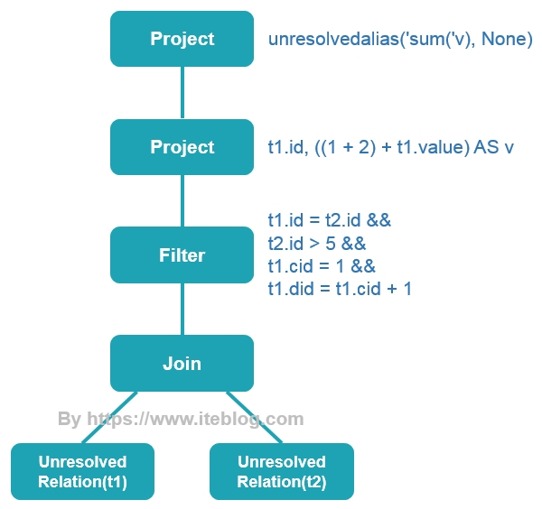

```scala
/** 保留尚未在目录中查找的关系的名称 */
// 注意继承了叶子节点
case class UnresolvedRelation(tableIdentifier: TableIdentifier) extends LeafNode {
  /** Returns a `.` separated name for this relation. */
  def tableName: String = tableIdentifier.unquotedString

  override def output: Seq[Attribute] = Nil

  override lazy val resolved = false
}
```

```scala
/**
 * 保留尚未别名的表达式。
 *
 * @param child 分析期间需要解决的计算。
 * @param aliasFunc 可选，指定函数以生成别名以与计算结果[[child]]相关联
 *
 */
case class UnresolvedAlias(
    child: Expression,
    aliasFunc: Option[Expression => String] = None)
  extends UnaryExpression with NamedExpression with Unevaluable {

  override def toAttribute: Attribute = throw new UnresolvedException(this, "toAttribute")
  override def qualifier: Option[String] = throw new UnresolvedException(this, "qualifier")
  override def exprId: ExprId = throw new UnresolvedException(this, "exprId")
  override def nullable: Boolean = throw new UnresolvedException(this, "nullable")
  override def dataType: DataType = throw new UnresolvedException(this, "dataType")
  override def name: String = throw new UnresolvedException(this, "name")
  override def newInstance(): NamedExpression = throw new UnresolvedException(this, "newInstance")

  override lazy val resolved = false
}
```

### Analyzer

从上图中可以看出，未解析的逻辑计划 Unresolved LogicalPlan 包含了 UnresolvedRelation 和 unresolvedalias 等对象

Unresolved LogicalPlan 仅仅是一种数据结构，不包含任何数据信息，比如不知道数据源、数据类型，不同的列来自于哪张表等。Analyzer 阶段会使用事先定义好的 Rule 以及 SessionCatalog 等信息对 Unresolved LogicalPlan 进行 transform。SessionCatalog 主要用于各种函数资源信息和元数据信息（数据库、数据表、数据视图、数据分区与函数等）的统一管理。

```sql
== Analyzed Logical Plan ==
sum(v): bigint
Aggregate [sum(cast(v#16 as bigint)) AS sum(v)#22L]
+- SubqueryAlias `iteblog`
   +- Project [id#0, ((1 + 2) + value#1) AS v#16]
      +- Filter (((id#0 = id#8) && (cid#2 = 1)) && ((did#3 = (cid#2 + 1)) && (id#8 > 5)))
         +- Join Inner
            :- SubqueryAlias `t1`
            :  +- Relation[id#0,value#1,cid#2,did#3] csv
            +- SubqueryAlias `t2`
               +- Relation[id#8,value#9,cid#10,did#11] csv
```

从上面的结果可以看出，t1 和 t2 表已经解析成带有 id、value、cid 以及 did 四个列的表，其中这个表的数据源来自于 csv 文件。而且每个列的位置和数据类型已经确定了，sum 被解析成 Aggregate 函数了。下面是从 Unresolved LogicalPlan 转换到 Analyzed Logical Plan 对比图。

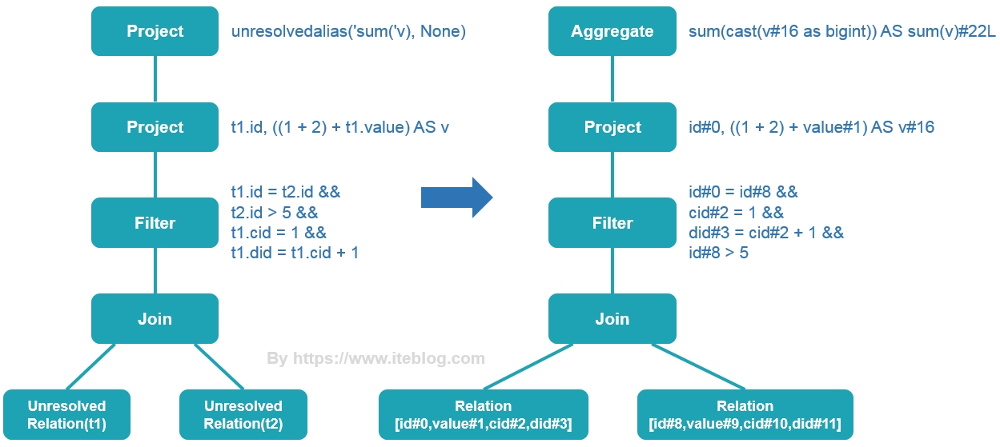

### Optimizer

Analyzed Logical Plan 是可以直接转换成 Physical Plan 然后在 Spark 中执行。但是如果直接这么弄的话，得到的 Physical Plan 很可能不是最优的，因为在实际应用中，很多低效的写法会带来执行效率的问题，Optimizer 则进一步对Analyzed Logical Plan 进行处理，得到更优的逻辑算子树。

这个阶段的优化器主要是基于规则的（Rule-based Optimizer，简称 RBO），而绝大部分的规则都是启发式规则，也就是基于直观或经验而得出的规则，例如以下几种情况：

#### 谓词下推

这个过程主要将过滤条件尽可能地下推到底层，最好是数据源。

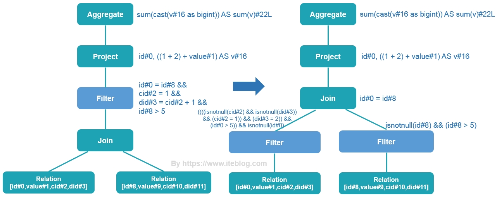

#### 列剪裁

因为我们查询的表可能有很多个字段，但是每次查询我们很大可能不需要扫描出所有的字段，这个时候利用列裁剪可以把那些查询不需要的字段过滤掉，使得扫描的数据量减少。

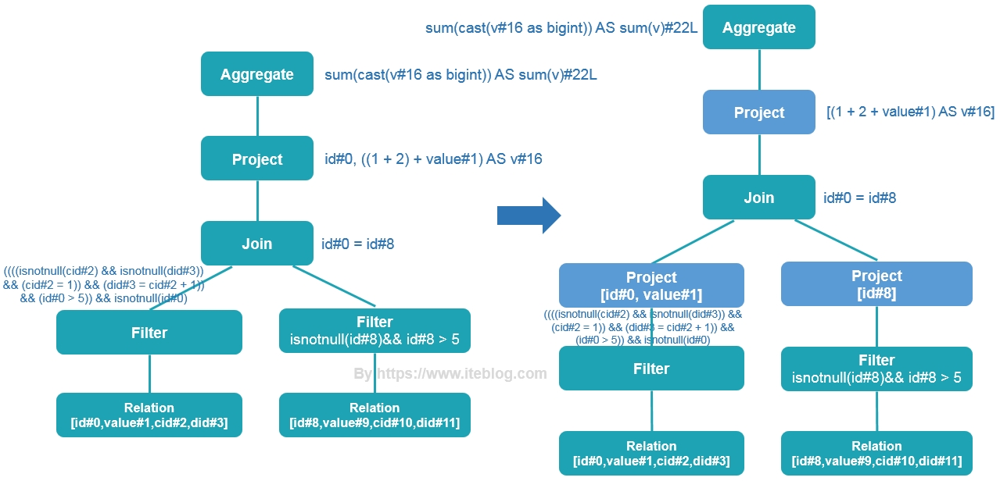

#### 常量替换

也就是将变量替换成常量，比如 SELECT * FROM table WHERE i = 5 AND j = i + 3 可以转换成 SELECT * FROM table WHERE i = 5 AND j = 8。

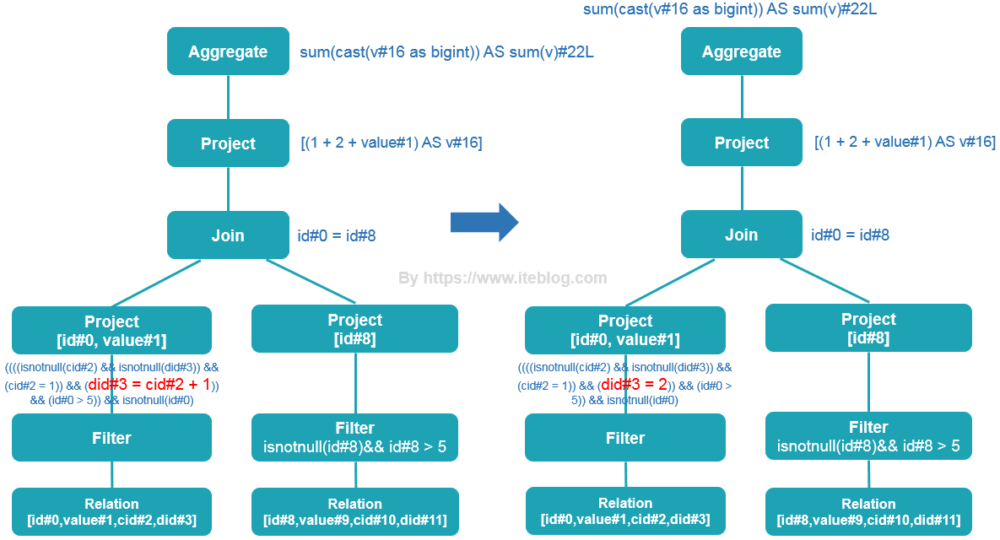

```sql
== Optimized Logical Plan ==
Aggregate [sum(cast(v#16 as bigint)) AS sum(v)#22L]
+- Project [(3 + value#1) AS v#16]
   +- Join Inner, (id#0 = id#8)
      :- Project [id#0, value#1]
      :  +- Filter (((((isnotnull(cid#2) && isnotnull(did#3)) && (cid#2 = 1)) && (did#3 = 2)) && (id#0 > 5)) && isnotnull(id#0))
      :     +- Relation[id#0,value#1,cid#2,did#3] csv
      +- Project [id#8]
         +- Filter (isnotnull(id#8) && (id#8 > 5))
            +- Relation[id#8,value#9,cid#10,did#11] csv
```

#### 常量累加

这个阶段把一些常量表达式事先计算好。

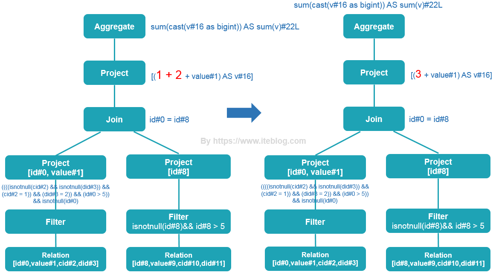

最终 Optimized Logical Plan 如下：

```sql
== Optimized Logical Plan ==
Aggregate [sum(cast(v#16 as bigint)) AS sum(v)#22L]
+- Project [(3 + value#1) AS v#16]
   +- Join Inner, (id#0 = id#8)
      :- Project [id#0, value#1]
      :  +- Filter (((((isnotnull(cid#2) && isnotnull(did#3)) && (cid#2 = 1)) && (did#3 = 2)) && (id#0 > 5)) && isnotnull(id#0))
      :     +- Relation[id#0,value#1,cid#2,did#3] csv
      +- Project [id#8]
         +- Filter (isnotnull(id#8) && (id#8 > 5))
            +- Relation[id#8,value#9,cid#10,did#11] csv
```

### SparkPlanner

Logical Plan 其实并不能被执行的，为了能够执行这个 SQL，一定需要翻译成物理计划

```sql
== Physical Plan ==
*(3) HashAggregate(keys=[], functions=[sum(cast(v#16 as bigint))], output=[sum(v)#22L])
+- Exchange SinglePartition
   +- *(2) HashAggregate(keys=[], functions=[partial_sum(cast(v#16 as bigint))], output=[sum#24L])
      +- *(2) Project [(3 + value#1) AS v#16]
         +- *(2) BroadcastHashJoin [id#0], [id#8], Inner, BuildRight
            :- *(2) Project [id#0, value#1]
            :  +- *(2) Filter (((((isnotnull(cid#2) && isnotnull(did#3)) && (cid#2 = 1)) && (did#3 = 2)) && (id#0 > 5)) && isnotnull(id#0))
            :     +- *(2) FileScan csv [id#0,value#1,cid#2,did#3] Batched: false, Format: CSV, Location: InMemoryFileIndex[file:/iteblog/t1.csv], PartitionFilters: [], PushedFilters: [IsNotNull(cid), IsNotNull(did), EqualTo(cid,1), EqualTo(did,2), GreaterThan(id,5), IsNotNull(id)], ReadSchema: struct<id:int,value:int,cid:int,did:int>
            +- BroadcastExchange HashedRelationBroadcastMode(List(cast(input[0, int, true] as bigint)))
               +- *(1) Project [id#8]
                  +- *(1) Filter (isnotnull(id#8) && (id#8 > 5))
                     +- *(1) FileScan csv [id#8] Batched: false, Format: CSV, Location: InMemoryFileIndex[file:/iteblog/t2.csv], PartitionFilters: [], PushedFilters: [IsNotNull(id), GreaterThan(id,5)], ReadSchema: struct<id:int>
```

从上面的结果可以看出，物理计划阶段已经知道数据源是从 csv 文件里面读取了，也知道文件的路径，数据类型等。而且在读取文件的时候，直接将过滤条件（PushedFilters）加进去了。同时，这个 Join 变成了 BroadcastHashJoin，也就是将 t2 表的数据 Broadcast 到 t1 表所在的节点。图表示如下：

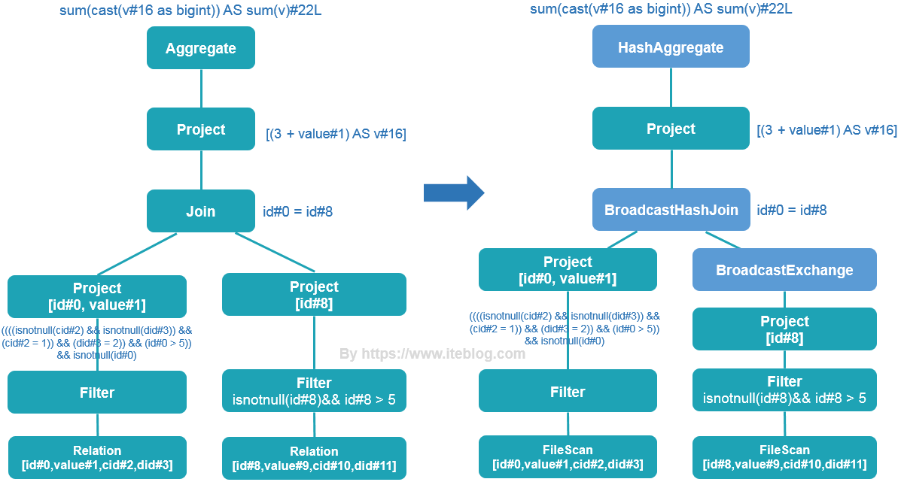

### WholeStageCodegen

```sql
+- *(1) Project [id#8]
   +- *(1) Filter (isnotnull(id#8) && (id#8 > 5))
      +- *(1) FileScan csv [id#8] Batched: false, Format: CSV, Location: InMemoryFileIndex[file:/iteblog/t2.csv], PartitionFilters: [], PushedFilters: [IsNotNull(id), GreaterThan(id,5)], ReadSchema: struct<id:int>
```

针对上述物理计划的其中一个阶段，通过全阶段代码生成，上面过程得到的代码如下，主要功能是：对每行的 id 进行 isnotnull(id#8) && (id#8 > 5) 表达式判断，然后拿到符合条件的行。

```java
/** Generated code: */

public Object generate(Object[] references) {
  return new GeneratedIteratorForCodegenStage1(references);
}

// codegenStageId=1
final class GeneratedIteratorForCodegenStage1 extends org.apache.spark.sql.execution.BufferedRowIterator {
  private Object[] references;
  private scala.collection.Iterator[] inputs;
  private org.apache.spark.sql.catalyst.expressions.codegen.UnsafeRowWriter[] filter_mutableStateArray_0 = new org.apache.spark.sql.catalyst.expressions.codegen.UnsafeRowWriter[2];
  private scala.collection.Iterator[] scan_mutableStateArray_0 = new scala.collection.Iterator[1];

  public GeneratedIteratorForCodegenStage1(Object[] references) {
    this.references = references;
  }

  public void init(int index, scala.collection.Iterator[] inputs) {   //在WholeStageCodegenExec类中的doExecute被调用
    partitionIndex = index;
    this.inputs = inputs;
    scan_mutableStateArray_0[0] = inputs[0];
    filter_mutableStateArray_0[0] = new org.apache.spark.sql.catalyst.expressions.codegen.UnsafeRowWriter(1, 0);
    filter_mutableStateArray_0[1] = new org.apache.spark.sql.catalyst.expressions.codegen.UnsafeRowWriter(1, 0);

  }

  protected void processNext() throws java.io.IOException {  //处理每行数据，这个就是isnotnull(id#8) && (id#8 > 5)表达式的判断
    while (scan_mutableStateArray_0[0].hasNext()) {
      InternalRow scan_row_0 = (InternalRow) scan_mutableStateArray_0[0].next();
      ((org.apache.spark.sql.execution.metric.SQLMetric) references[0] /* numOutputRows */).add(1);
      do {
        boolean scan_isNull_0 = scan_row_0.isNullAt(0);     //判断id是否为空
        int scan_value_0 = scan_isNull_0 ?                  //如果为空则scan_value_0等于－1，否则就是id的值
        -1 : (scan_row_0.getInt(0));

        if (!(!scan_isNull_0)) continue;                   //如果id为空这行数据就不要了

        boolean filter_value_2 = false;
        filter_value_2 = scan_value_0 > 5;                 //id是否大于5
        if (!filter_value_2) continue;                     //如果id不大于5，则这行数据不要了

        ((org.apache.spark.sql.execution.metric.SQLMetric) references[1] /* numOutputRows */).add(1);

        filter_mutableStateArray_0[1].reset();

        if (false) {
          filter_mutableStateArray_0[1].setNullAt(0);
        } else {
          filter_mutableStateArray_0[1].write(0, scan_value_0);  //这个就是符合isnotnull(id#8) && (id#8 > 5)表达式的id
        }
        append((filter_mutableStateArray_0[1].getRow()));        //得到符号条件的行

      } while(false);
      if (shouldStop()) return;
    }
  }

}
```

**注意：代码生成是在 Driver 端进行的，而之后代码编译是在 Executor 端进行的。**

最终生成DAG：

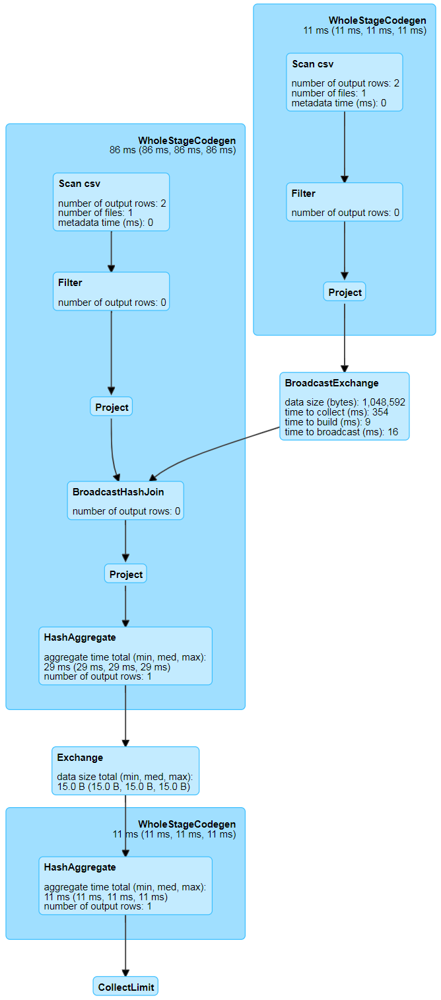


## SparkSql源码分析

### Catalyst架构分析

- Catalyst 是与Spark 解耦的一个独立库， 是一个impl-free 的执行计划的生成和优化框架。包含了parser，analyzer，optimizer，trees，rules等
- 其他系统如果想基于 Spark 做一些类SQL 、标准SQL 甚至其他查询语言的查询，需要基于 Catalyst 提供的解析器、执行计划树结构、逻辑执行计划的处理规则体系等类体系来实现执行计划的解析、生成、优化、映射工作。
- 在规则方面，提供的优化规则是比较基础的（和Pig/Hive 比，没有那么丰富）。不过，一些优化规则其实是要涉及具体物理算子的，所以，部分规则需要在系统方自己制定和实现（如spark-sqI 里的SparkStrategy ）。

### Sql执行流程简图

$$
\begin{CD}
    sql\;string  @>{\text{SqlParser}}>> {unresolved\;logical\;plan \\ UnresolvedRelation} @>{\text{Ananyzer}}>{\text{Session Catalog}\\ \text{Rule}}> {resolved\;logical\;plan \\ Relation} \\
        @. @. @V{\text{Optimizer}}V{\text{Rule}}V \\
    Selected\;physical\;plan @<{\text{Cost Model}}<< physical\;plans @<{\text{SparkPlan}}<< optimized\;logical\;plan \\
        @VV{\text{Query Execution}}V @. @. \\
        RDDs(Stages)
\end{CD}
$$

### TreeNode

- TreeNode 有QueryPlan 和Expression 两个子类继承体系。

  - QueryPlan 下面是逻辑计划和物理执行计划两个体系，LogicalPlan在Catalyst 里有详细实现，物理执行计划表示由使用方实现

    - 逻辑计划 LogicalPlan 中 TreeNode 可以细分成 3 种类型的Node

      - UnaryNode 一元节点，即只有一个子节点，如Limit 、Filter 操作。
      - BinaryNode 二元节点，即有左右子节点的二叉节点，如Join 、Union 操作。
      - LeatNode 叶子节点，没有子节点的节点， 主要用于命令类操作，如SetCommand

    - 物理执行计划节点在具体系统里实现，如 spark-sqI 工程里的SparkPlan继承体系。SparkStrategies 继承了QueryPlanner[SparkPlan］，内部制定了 LeftSemiJoin 、HashJoin 、PartialAggregation 、BroadcastNestedLoopJoin、CartesianProduct 等几种策略， 每种策略接受的都是一个LogicalPlan， 生成的是Seq[SparkPlan］，每个SparkPlan 理解为具体RDD 的算子操作。

      ```scala
      abstract class SparkStrategy extends GenericStrategy[SparkPlan] {
        override protected def planLater(plan: LogicalPlan): SparkPlan = PlanLater(plan)
      }
      ```

  - Expression 是表达式体系

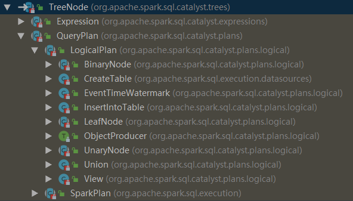

### LogicalPlan

维护着一套统计数据和属性数据，也提供了解析方法，同时延伸了3 种类型的LogicalPlan：

1. LeafNode ：对应于trees.LeafNode 的LogicalPlan
2. UnaryNode ： 对应于trees.UnaryNode 的LogicalPlan
3. BinaryNode ：对应于trees.BinaryNode 的LogicalPlan

对于SQL 语句解析时， 会调用和SQL 匹配的操作方法进行解析： 这些操作分4 大类，最终生成LeafNode 、UnaryNode 、BinaryNode 中的一种。

1. basicOperators ： 一些数据基本操作，如Join 、Union 、F ilter、Project 、Sort
2. commands ： 一些命令操作， 如SetCommand 、CacheCommand
3. partitioning ： 一些分区操作， 如RedistributeData
4. ScriptTransformation ： 对脚本的处理，如ScriptTransformation


### QueryExecution源码

show() 是一个Action算子，触发了job的执行

```scala
/** Dataset.scala */
def show(numRows: Int, truncate: Boolean): Unit = if (truncate) {
  println(showString(numRows, truncate = 20))
} else {
  println(showString(numRows, truncate = 0))
}

private[sql] def showString(_numRows: Int, truncate: Int = 20): String = {
  val numRows = _numRows.max(0)
  val takeResult = toDF().take(numRows + 1)
    
def toDF(): DataFrame = new Dataset[Row](sparkSession, queryExecution, RowEncoder(schema))
    
def take(n: Int): Array[T] = head(n)
// 触发job执行
def head(n: Int): Array[T] = withAction("head", limit(n).queryExecution)(collectFromPlan)
```

spark.sql("xxx") 返回了一个DataFrame。它是在 Dataset.ofRows(sparkSession, logicalPlan) 方法里实例化的

```scala
/** SparkSession.scala */
def sql(sqlText: String): DataFrame = {
  Dataset.ofRows(self, sessionState.sqlParser.parsePlan(sqlText))
}

/** Dataset.scala */
def ofRows(sparkSession: SparkSession, logicalPlan: LogicalPlan): DataFrame = {
  val qe = sparkSession.sessionState.executePlan(logicalPlan)
  qe.assertAnalyzed()
  new Dataset[Row](sparkSession, qe, RowEncoder(qe.analyzed.schema))
}
```

ofRows 方法会生成一个执行计划 QueryExecution ，这是Spark执行关系查询的主要工作流程：

- 传入 SparkSession、Unresolved LogicalPlan 的实例
- 调用 sessionState.analyzer 得到 analyzed LogicalPlan 
- 调用 sessionState.optimizer 得到 optimized LogicalPlan 
- 调用 queryPlanner.plan(ReturnAnswer(optimizedPlan)).next() 得到 SparkPlan / PhysicalPlan

```scala
/**
 * 使用Spark执行关系查询的主要工作流程。 该设计使开发人员轻松访问查询执行的中间阶段。
 *
 * 尽管这不是公共类，但应该避免更改函数名称，因为许多开发人员都使用该功能进行调试。
 */
class QueryExecution(val sparkSession: SparkSession, val logical: LogicalPlan) {

  // TODO: 将优化器optimizer从SessionState移到此处。
  protected def planner = sparkSession.sessionState.planner

  def assertAnalyzed(): Unit = {
    // 在try块外部调用Analyzer，以避免在下面的catch块中再次调用它。
    analyzed
    try {
      sparkSession.sessionState.analyzer.checkAnalysis(analyzed)
    } catch {
      case e: AnalysisException =>
        val ae = new AnalysisException(e.message, e.line, e.startPosition, Option(analyzed))
        ae.setStackTrace(e.getStackTrace)
        throw ae
    }
  }

  def assertSupported(): Unit = {
    if (sparkSession.sessionState.conf.isUnsupportedOperationCheckEnabled) {
      UnsupportedOperationChecker.checkForBatch(analyzed)
    }
  }

  // 调用 analyzer 解析器
  lazy val analyzed: LogicalPlan = {
    SparkSession.setActiveSession(sparkSession)
    sparkSession.sessionState.analyzer.execute(logical)
  }

  lazy val withCachedData: LogicalPlan = {
    assertAnalyzed()
    assertSupported()
    sparkSession.sharedState.cacheManager.useCachedData(analyzed)
  }

  // 调用 optimizer 优化器
  lazy val optimizedPlan: LogicalPlan = sparkSession.sessionState.optimizer.execute(withCachedData)

  // 将优化后的逻辑执行计划转换成物理执行计划
  lazy val sparkPlan: SparkPlan = {
    SparkSession.setActiveSession(sparkSession)
    // TODO: 使用 next 方法，例如，从计划器 planner 返回第一个讨划 plan ，现在在这里选择最佳的计划
    planner.plan(ReturnAnswer(optimizedPlan)).next()
  }

  // executedPlan 不应该被用来初始化任何 SparkPlan ，它应该只用于执行
  lazy val executedPlan: SparkPlan = prepareForExecution(sparkPlan)

  /** 转换为内部的 RDD，避免复制及没有schema */
  lazy val toRdd: RDD[InternalRow] = executedPlan.execute()

  /**
   * 准备一个计划［ SparkPlan ]，用于执行 Shuffle 算子和内部行格式转换的需要
   */
  protected def prepareForExecution(plan: SparkPlan): SparkPlan = {
    preparations.foldLeft(plan) { case (sp, rule) => rule.apply(sp) }
  }

  /** 在执行物理计划前应用的一系列规则 */
  protected def preparations: Seq[Rule[SparkPlan]] = Seq(
    python.ExtractPythonUDFs,
    PlanSubqueries(sparkSession),                          //特殊子查询物理计划处理
    EnsureRequirements(sparkSession.sessionState.conf),    //确保执行计划分区与排序正确性
    CollapseCodegenStages(sparkSession.sessionState.conf), //代码生成
    ReuseExchange(sparkSession.sessionState.conf),         //节点重用
    ReuseSubquery(sparkSession.sessionState.conf))         //子查询重用

  protected def stringOrError[A](f: => A): String =
    try f.toString catch { case e: AnalysisException => e.toString }


  /**
   * 作为一个 Hive 兼容序列的字符串返回结果。这是一个测试
   */
  def hiveResultString(): Seq[String] = executedPlan match {
    case ExecutedCommandExec(desc: DescribeTableCommand) =>
      // 如果是一个描述 Hive 表的描述命令，我们要输出的格式与 Hive 相似
      desc.run(sparkSession).map {
        case Row(name: String, dataType: String, comment) =>
          Seq(name, dataType,
            Option(comment.asInstanceOf[String]).getOrElse(""))
            .map(s => String.format(s"%-20s", s))
            .mkString("\t")
      }
    // HOW TABLES 在 Hive 中仅输出表的名称，我们输出数据库、表名等，是临时的内容
    case command @ ExecutedCommandExec(s: ShowTablesCommand) if !s.isExtended =>
      command.executeCollect().map(_.getString(1))
    case other =>
      val result: Seq[Seq[Any]] = other.executeCollectPublic().map(_.toSeq).toSeq
      // 我们需要的类型，所以我们可以输出结构的字段名称
      val types = analyzed.output.map(_.dataType)
      // 重新格式化匹配 Hive 的制表符分隔的输出 
      result.map(_.zip(types).map(toHiveString)).map(_.mkString("\t"))
  }

  /** 格式化数据（基于给定的数据类型〉，并返回字符串表示 */
  private def toHiveString(a: (Any, DataType)): String = {
    val primitiveTypes = Seq(StringType, IntegerType, LongType, DoubleType, FloatType,
      BooleanType, ByteType, ShortType, DateType, TimestampType, BinaryType)

    def formatDecimal(d: java.math.BigDecimal): String = {
      if (d.compareTo(java.math.BigDecimal.ZERO) == 0) {
        java.math.BigDecimal.ZERO.toPlainString
      } else {
        d.stripTrailingZeros().toPlainString
      }
    }

    /** Hive 输出的结构与顶层的属性字段的输出略有不同 */
    def toHiveStructString(a: (Any, DataType)): String = a match {
      case (struct: Row, StructType(fields)) =>
        struct.toSeq.zip(fields).map {
          case (v, t) => s""""${t.name}":${toHiveStructString(v, t.dataType)}"""
        }.mkString("{", ",", "}")
      case (seq: Seq[_], ArrayType(typ, _)) =>
        seq.map(v => (v, typ)).map(toHiveStructString).mkString("[", ",", "]")
      case (map: Map[_, _], MapType(kType, vType, _)) =>
        map.map {
          case (key, value) =>
            toHiveStructString((key, kType)) + ":" + toHiveStructString((value, vType))
        }.toSeq.sorted.mkString("{", ",", "}")
      case (null, _) => "null"
      case (s: String, StringType) => "\"" + s + "\""
      case (decimal, DecimalType()) => decimal.toString
      case (other, tpe) if primitiveTypes contains tpe => other.toString
    }

    a match {
      case (struct: Row, StructType(fields)) =>
        struct.toSeq.zip(fields).map {
          case (v, t) => s""""${t.name}":${toHiveStructString(v, t.dataType)}"""
        }.mkString("{", ",", "}")
      case (seq: Seq[_], ArrayType(typ, _)) =>
        seq.map(v => (v, typ)).map(toHiveStructString).mkString("[", ",", "]")
      case (map: Map[_, _], MapType(kType, vType, _)) =>
        map.map {
          case (key, value) =>
            toHiveStructString((key, kType)) + ":" + toHiveStructString((value, vType))
        }.toSeq.sorted.mkString("{", ",", "}")
      case (null, _) => "NULL"
      case (d: Date, DateType) =>
        DateTimeUtils.dateToString(DateTimeUtils.fromJavaDate(d))
      case (t: Timestamp, TimestampType) =>
        DateTimeUtils.timestampToString(DateTimeUtils.fromJavaTimestamp(t),
          DateTimeUtils.getTimeZone(sparkSession.sessionState.conf.sessionLocalTimeZone))
      case (bin: Array[Byte], BinaryType) => new String(bin, StandardCharsets.UTF_8)
      case (decimal: java.math.BigDecimal, DecimalType()) => formatDecimal(decimal)
      case (other, tpe) if primitiveTypes.contains(tpe) => other.toString
    }
  }

  def simpleString: String = {
    s"""== Physical Plan ==
       |${stringOrError(executedPlan.treeString(verbose = false))}
      """.stripMargin.trim
  }

  override def toString: String = completeString(appendStats = false)

  def toStringWithStats: String = completeString(appendStats = true)

  private def completeString(appendStats: Boolean): String = {
    def output = Utils.truncatedString(
      analyzed.output.map(o => s"${o.name}: ${o.dataType.simpleString}"), ", ")
    val analyzedPlan = Seq(
      stringOrError(output),
      stringOrError(analyzed.treeString(verbose = true))
    ).filter(_.nonEmpty).mkString("\n")

    val optimizedPlanString = if (appendStats) {
      // 触发逻辑计划统计
      optimizedPlan.stats(sparkSession.sessionState.conf)
      optimizedPlan.treeString(verbose = true, addSuffix = true)
    } else {
      optimizedPlan.treeString(verbose = true)
    }

    s"""== Parsed Logical Plan ==
       |${stringOrError(logical.treeString(verbose = true))}
       |== Analyzed Logical Plan ==
       |$analyzedPlan
       |== Optimized Logical Plan ==
       |${stringOrError(optimizedPlanString)}
       |== Physical Plan ==
       |${stringOrError(executedPlan.treeString(verbose = true))}
    """.stripMargin.trim
  }

  /** 用于调试查询执行命令的特殊命名空间 */
  // scalastyle:o关
  object debug {
  // scalastyle:开

    /**
     * 打印到标准输出在这个计划中所有生成的代码（即每个 WholeStageCodegen 子树的输出)
     */
    def codegen(): Unit = {
      // scalastyle:关闭打印
      println(org.apache.spark.sql.execution.debug.codegenString(executedPlan))
      // scalastyle:打开打印
    }
  }
}
```


### SqlParser源码

```scala
/** SparkSession.scala */
def sql(sqlText: String): DataFrame = {
  Dataset.ofRows(self, sessionState.sqlParser.parsePlan(sqlText))
}

/** Dataset.scala */
def ofRows(sparkSession: SparkSession, logicalPlan: LogicalPlan): DataFrame = {
  val qe = sparkSession.sessionState.executePlan(logicalPlan)
  qe.assertAnalyzed()
  new Dataset[Row](sparkSession, qe, RowEncoder(qe.analyzed.schema))
}
```

Dataset.ofRows 方法要传入一个 logicalPlan 逻辑计划，这里传入的是 sessionState.sqlParser.parsePlan(sqlText) 。sessionState 具体是在 SparkSession.instantiateSessionState 方法中进行实例化的

```scala
/** SparkSession.scala */
lazy val sessionState: SessionState = {
  parentSessionState
    .map(_.clone(this))
    .getOrElse {
        // 创建 SessionState 的实例
      SparkSession.instantiateSessionState(
        SparkSession.sessionStateClassName(sparkContext.conf),
        self)
    }
```

sessionState.sqlParser 是一个属性，它是SparkSqlParser 的实例，向上转型为 ParserInterface 特质

```scala
trait ParserInterface {
  /**
   * 根据给定的SQL字符串创建一个 LogicalPlan
   */
  @throws[ParseException]("Text cannot be parsed to a LogicalPlan")
  def parsePlan(sqlText: String): LogicalPlan

  /**
   * 根据给定的SQL字符串创建一个表达式 Expression
   */
  @throws[ParseException]("Text cannot be parsed to an Expression")
  def parseExpression(sqlText: String): Expression

  /**
   * 根据给定的SQL字符串创建一个表标识 Tableidentifier
   */
  @throws[ParseException]("Text cannot be parsed to a TableIdentifier")
  def parseTableIdentifier(sqlText: String): TableIdentifier

  /**
   * 解析字符串为函数标识［ Functionidentifier]
   */
  @throws[ParseException]("Text cannot be parsed to a FunctionIdentifier")
  def parseFunctionIdentifier(sqlText: String): FunctionIdentifier

  /**
   * 解析字符串和为结构类型［StructType], SQL 字符串应该使用逗号分隔的列表字段定义，
   * 该字段定义将保存正确的Hive元数据
   */
  @throws[ParseException]("Text cannot be parsed to a schema")
  def parseTableSchema(sqlText: String): StructType

  /**
   * Parse a string to a [[DataType]].
   */
  @throws[ParseException]("Text cannot be parsed to a DataType")
  def parseDataType(sqlText: String): DataType
}
```

ParserInterface 的实现者，也即 SparkSqlParser 的父类：AbstractSqlParser 在解析SQL生成 LogicalPlan 逻辑计划是引入了第三方语法解析器工具 ANTLR4。具体来说是 Spark 基于 presto 的语法文件定义了 Spark SQL 语法文件 SqlBase.g4，然后使用 ANTLR4 对 SqlBase.g4 文件自动解析生成几个 Java 类，其中就包含重要的**词法分析器** SqlBaseLexer.java （解析关键词以及各种标识符等），和**语法分析器 ** SqlBaseParser.java（构建语法树）

生成语法树之后，使用 AstBuilder.visitSingleStatement 将语法树转换成 LogicalPlan，这个 LogicalPlan 也被称为 Unresolved LogicalPlan

```Scala
abstract class AbstractSqlParser extends ParserInterface with Logging {
    ...
  /** Creates LogicalPlan for a given SQL string. */
  override def parsePlan(sqlText: String): LogicalPlan = parse(sqlText) { parser =>
    astBuilder.visitSingleStatement(parser.singleStatement()) match {
      case plan: LogicalPlan => plan
      case _ =>
        val position = Origin(None, None)
        throw new ParseException(Option(sqlText), "Unsupported SQL statement", position, position)
    }
  }
    ...
  protected def parse[T](command: String)(toResult: SqlBaseParser => T): T = {
    logInfo(s"Parsing command: $command")

    // 是 ANTLR4 自动生成的词法分析器 SqlBaseLexer
    val lexer = new SqlBaseLexer(new ANTLRNoCaseStringStream(command))
    lexer.removeErrorListeners()
    lexer.addErrorListener(ParseErrorListener)

    val tokenStream = new CommonTokenStream(lexer)
      
    // 是 ANTLR4 自动生成的语法分析器 SqlBaseParser
    val parser = new SqlBaseParser(tokenStream)
    parser.addParseListener(PostProcessor)
    parser.removeErrorListeners()
    parser.addErrorListener(ParseErrorListener)

    try {
      try {
        // 首先，使用可能更快的SLL模式尝试分析
        parser.getInterpreter.setPredictionMode(PredictionMode.SLL)
        toResult(parser)
      }
      catch {
        case e: ParseCancellationException =>
          // 如果解析失败，使用 LL 模式进行解析
          tokenStream.reset() // rewind input stream
          parser.reset()

          // 重新试一次
          parser.getInterpreter.setPredictionMode(PredictionMode.LL)
          toResult(parser)
      }
    }
    catch {
      case e: ParseException if e.command.isDefined =>
        throw e
      case e: ParseException =>
        throw e.withCommand(command)
      case e: AnalysisException =>
        val position = Origin(e.line, e.startPosition)
        throw new ParseException(Option(command), e.message, position, position)
    }
  }
}
```

6. ParserInterface.parsePlan 会生成一个逻辑计划 Unresolved LogicalPlan

### Analyzer源码

Unresolved LogicalPlan 仅仅是一种数据结构，不包含任何数据信息，比如不知道数据源、数据类型，不同的列来自于哪张表等。Analyzer 阶段会使用事先定义好的 Rule 以及 SessionCatalog 等信息对 Unresolved LogicalPlan 进行 transform。SessionCatalog 主要用于各种函数资源信息和元数据信息（数据库、数据表、数据视图、数据分区与函数等）的统一管理。

```scala
class Analyzer(
    catalog: SessionCatalog,
    conf: SQLConf,
    maxIterations: Int)
  extends RuleExecutor[LogicalPlan] with CheckAnalysis {
      ...
  // 一批规则，每个 Batch 对象由一系列 Rule 组成，采用一个策略。
  lazy val batches: Seq[Batch] = Seq(
    // 提示策略
    Batch("Hints", fixedPoint,
      new ResolveHints.ResolveBroadcastHints(conf),
      ResolveHints.RemoveAllHints),
    // 简单检查策略
    Batch("Simple Sanity Check", Once,
      LookupFunctions),
    Batch("Substitution", fixedPoint,
      CTESubstitution,
      WindowsSubstitution,
      EliminateUnions,
      new SubstituteUnresolvedOrdinals(conf)),
    Batch("Resolution", fixedPoint,
      ResolveTableValuedFunctions ::		//解析表的函数
      ResolveRelations ::				   //解析表或视图
      ResolveReferences ::				   //解析列
      ResolveCreateNamedStruct ::
      ResolveDeserializer ::			   //解析反序列化操作类
      ResolveNewInstance ::
      ResolveUpCast ::					  //解析类型转换
      ResolveGroupingAnalytics ::
      ResolvePivot ::
      ResolveOrdinalInOrderByAndGroupBy ::
      ResolveAggAliasInGroupBy ::
      ResolveMissingReferences ::
      ExtractGenerator ::
      ResolveGenerate ::
      ResolveFunctions ::				  //解析函数
      ResolveAliases ::					  //解析表别名
      ResolveSubquery ::				  //解析子查询
      ResolveWindowOrder ::
      ResolveWindowFrame ::
      ResolveNaturalAndUsingJoin ::
      ExtractWindowExpressions ::
      GlobalAggregates ::
      ResolveAggregateFunctions ::
      TimeWindowing ::
      ResolveInlineTables(conf) ::
      ResolveTimeZone(conf) ::
      TypeCoercion.typeCoercionRules ++
      extendedResolutionRules : _*),
    // 事后解决策略
    Batch("Post-Hoc Resolution", Once, postHocResolutionRules: _*),
    Batch("View", Once,
      AliasViewChild(conf)),
    Batch("Nondeterministic", Once,
      PullOutNondeterministic),
    Batch("UDF", Once,
      HandleNullInputsForUDF),
    Batch("FixNullability", Once,
      FixNullability),
    // 子查询策略
    Batch("Subquery", Once,
      UpdateOuterReferences),
    Batch("Cleanup", fixedPoint,
      CleanupAliases)
  )
```

Analyzer 中，多个性质类似的 Rule 组成一个 Batch，而多个 Batch 构成一个 batches。这些 batches 会由 RuleExecutor 执行，先按一个一个 Batch 顺序执行，然后对 Batch 里面的每个 Rule 顺序执行。每个 Batch 会执行一次（Once）或多次（FixedPoint，由`spark.sql.optimizer.maxIterations` 参数决定），执行过程如下：


### Optimizer源码

Analyzed Logical Plan 是可以直接转换成 Physical Plan 然后在 Spark 中执行。但是如果直接这么弄的话，得到的 Physical Plan 很可能不是最优的，因为在实际应用中，很多低效的写法会带来执行效率的问题，Optimizer 则进一步对Analyzed Logical Plan 进行处理，得到更优的逻辑算子树。

Optimizer 的工作方式类似于 Analyzer，因为它们都继承自 RuleExecutor[LogicalPlan］，都是执行一系列的 Batch 操作， 生成 Optimized LogicalPlan 。

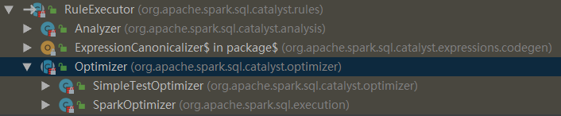

```scala
abstract class Optimizer(sessionCatalog: SessionCatalog, conf: SQLConf)
  extends RuleExecutor[LogicalPlan] {

  // 迭代次数的上限
  protected val fixedPoint = FixedPoint(conf.optimizerMaxIterations)

  def batches: Seq[Batch] = {
    // 严格说，Finish Analysis 中的某些规则不是优化器的规则，更多属于分析器，
    // 因为它们需要正确性（例如ComputeCurrentTime）。
    // 但是，由于我们还将分析器用于规范化查询（用于视图定义），因此不会消除子查询或在分析器中计算当前时间。
    Batch("Finish Analysis", Once,
      EliminateSubqueryAliases,
      EliminateView,
      ReplaceExpressions,
      ComputeCurrentTime,
      GetCurrentDatabase(sessionCatalog),
      RewriteDistinctAggregates,
      ReplaceDeduplicateWithAggregate) ::
    //////////////////////////////////////////////////////////////////////////////////////////
    // 优化器规则从这里开始：
    //////////////////////////////////////////////////////////////////////////////////////////
    // - 在启动主要的Optimizer规则之前，先执行CombineUnions的第一次调用，
    //   因为它可以减少迭代次数，而其他规则可以在两个相邻的Union运算符之间添加/移动额外的运算符。
    // - 在处理规则 Batch（“ Operator Optimizations”）中再次调用CombineUnions，
    //   因为其他规则可能会使两个单独的Unions运算符相邻。
    Batch("Union", Once,
      CombineUnions) ::
    Batch("Pullup Correlated Expressions", Once,
      PullupCorrelatedPredicates) ::
    Batch("Subquery", Once,
      OptimizeSubqueries) ::
    Batch("Replace Operators", fixedPoint,
      ReplaceIntersectWithSemiJoin,
      ReplaceExceptWithAntiJoin,
      ReplaceDistinctWithAggregate) ::
    Batch("Aggregate", fixedPoint,
      RemoveLiteralFromGroupExpressions,
      RemoveRepetitionFromGroupExpressions) ::
    Batch("Operator Optimizations", fixedPoint, Seq(
      // 运算符下推
      PushProjectionThroughUnion,
      ReorderJoin(conf),
      EliminateOuterJoin(conf),
      PushPredicateThroughJoin,
      PushDownPredicate,		// 谓词下推
      LimitPushDown(conf),
      ColumnPruning,			// 列剪裁
      InferFiltersFromConstraints(conf),
      // 运算符组合
      CollapseRepartition,
      CollapseProject,
      CollapseWindow,
      CombineFilters,
      CombineLimits,
      CombineUnions,
      // 常量折叠和强度降低
      NullPropagation(conf),
      FoldablePropagation,
      OptimizeIn(conf),
      ConstantFolding,		// 常量累加
      ReorderAssociativeOperator,
      LikeSimplification,
      BooleanSimplification,
      SimplifyConditionals,
      RemoveDispensableExpressions,
      SimplifyBinaryComparison,
      PruneFilters(conf),
      EliminateSorts,
      SimplifyCasts,
      SimplifyCaseConversionExpressions,
      RewriteCorrelatedScalarSubquery,
      EliminateSerialization,
      RemoveRedundantAliases,
      RemoveRedundantProject,
      SimplifyCreateStructOps,
      SimplifyCreateArrayOps,
      SimplifyCreateMapOps) ++
      extendedOperatorOptimizationRules: _*) ::
    Batch("Check Cartesian Products", Once,
      CheckCartesianProducts(conf)) ::
    Batch("Join Reorder", Once,
      CostBasedJoinReorder(conf)) ::
    Batch("Decimal Optimizations", fixedPoint,
      DecimalAggregates(conf)) ::
    Batch("Object Expressions Optimization", fixedPoint,
      EliminateMapObjects,
      CombineTypedFilters) ::
    Batch("LocalRelation", fixedPoint,
      ConvertToLocalRelation,
      PropagateEmptyRelation) ::
    Batch("OptimizeCodegen", Once,
      OptimizeCodegen(conf)) ::
    Batch("RewriteSubquery", Once,
      RewritePredicateSubquery,
      CollapseProject) :: Nil
  }
      ...
}
```

### SparkPlanner源码

一个逻辑计划（Logical Plan）经过一系列的策略处理之后，得到多个物理计划（Physical Plans），物理计划在 Spark 是由 SparkPlan 实现的。多个物理计划再经过代价模型（Cost Model）得到选择后的物理计划（Selected Physical Plan）。核心思想是计算每个物理计划的代价，然后得到最优的物理计划。但是在目前最新版的 Spark 2.4.3，这一部分并没有实现，直接返回多个物理计划列表的第一个作为最优的物理计划：

```scala
lazy val sparkPlan: SparkPlan = {
    SparkSession.setActiveSession(sparkSession)
    // TODO: We use next(), i.e. take the first plan returned by the planner, here for now,
    //       but we will implement to choose the best plan.
    planner.plan(ReturnAnswer(optimizedPlan)).next()
```


### WholeStageCodegen源码

物理计划还是不能直接交给 Spark 执行的，Spark 最后仍然会用一些 Rule 对 SparkPlan 进行处理，这个过程是 prepareForExecution 过程，在 preparations 中指定了一些规则 Rule：

```scala
 /** QueryExecution.scala */

  // 将优化后的逻辑执行计划转换成物理执行计划
  lazy val sparkPlan: SparkPlan = {
    SparkSession.setActiveSession(sparkSession)
    // TODO: 使用 next 方法，例如，从计划器 planner 返回第一个讨划 plan ，现在在这里选择最佳的计划
    planner.plan(ReturnAnswer(optimizedPlan)).next()
  }

  // 上面的物理计划 sparkPlan 还不能直接用，还需要调用 prepareForExecution
  lazy val executedPlan: SparkPlan = prepareForExecution(sparkPlan)

  /** 转换为内部的 RDD，避免复制及没有schema */
  lazy val toRdd: RDD[InternalRow] = executedPlan.execute()

  /**
   * 准备一个计划［ SparkPlan ]，用于执行 Shuffle 算子和内部行格式转换的需要
   */
  protected def prepareForExecution(plan: SparkPlan): SparkPlan = {
    preparations.foldLeft(plan) { case (sp, rule) => rule.apply(sp) }
  }

  /** 在执行物理计划前应用的一系列规则 */
  protected def preparations: Seq[Rule[SparkPlan]] = Seq(
    python.ExtractPythonUDFs,
    PlanSubqueries(sparkSession),                          //特殊子查询物理计划处理
    EnsureRequirements(sparkSession.sessionState.conf),    //确保执行计划分区与排序正确性
    CollapseCodegenStages(sparkSession.sessionState.conf), //代码生成
    ReuseExchange(sparkSession.sessionState.conf),         //节点重用
    ReuseSubquery(sparkSession.sessionState.conf))         //子查询重用
```

上面的 Rule 中 `CollapseCodegenStages` 是重头戏，如果需要 Spark 进行全阶段代码生成，需要将 `spark.sql.codegen.wholeStage` 设置为 true（默认）。

org.apache.spark.sql.execution.WholeStageCodegenExec 里面的 doExecute 方法里面被调用。而这个方法里面的 rdd 会将数据传进生成的代码里面 ，比如我们上文 SQL 这个例子的数据源是 csv 文件，底层使用 org.apache.spark.sql.execution.FileSourceScanExec 这个类读取文件，然后生成 inputRDD，这个 rdd 在 WholeStageCodegenExec 类中的 doExecute 方法里面调用生成的代码，然后执行我们各种判断得到最后的结果。WholeStageCodegenExec 类中的 doExecute 方法部分代码如下：

```scala
/** WholeStageCodegenExec.doExecute(): RDD[InternalRow] */

// rdds 可以从 FileSourceScanExec 的 inputRDDs 方法获取
val rdds = child.asInstanceOf[CodegenSupport].inputRDDs()
 
......
 
rdds.head.mapPartitionsWithIndex { (index, iter) =>
    // 编译生成好的代码
    val (clazz, _) = CodeGenerator.compile(cleanedSource)
    // 前面说了所有生成的代码都是继承自 BufferedRowIterator
    val buffer = clazz.generate(references).asInstanceOf[BufferedRowIterator]
    // 调用生成代码的 init 方法，主要传入 iter 迭代器，这里面就是我们要的数据
    buffer.init(index, Array(iter))
    new Iterator[InternalRow] {
      override def hasNext: Boolean = {
        // 这个会调用生成的代码中 processNext() 方法，里面就会根据表达式对每行数据进行判断
        val v = buffer.hasNext
        if (!v) durationMs += buffer.durationMs()
        v
      }
      override def next: InternalRow = buffer.next()
    }
｝
 
......
```


## 数据源

### 1.本地/HDFS文件

1. SparkSQL的默认数据源为Parquet格式

```scala
val df = spark.read.load("examples/src/main/resources/users.parquet") 
df.write.save("namesAndFavColors.parquet")
```

2. 当数据源格式不是parquet格式文件时，需要手动指定数据源的格式

   支持的文件格式还有：Jason、csv、orc

```scala
val df = spark.read.format("json").load("examples/src/main/resources/people.json")
val df2 = spark.read.json("examples/src/main/resources/people.json")

df.write.format("json").save("hdfs://hadoop102:9000/namesAndAges.json")
```

**保存模式：**

| SaveMode         | meaning              |
| ---------------- | -------------------- |
| "error"(default) | 如果文件存在，则报错 |
| "append"         | 追加                 |
| "overwrite"      | 覆写                 |
| "ignore"         | 数据存在，则忽略     |

```scala
df.select("name").write.format("parquet").mode("overwrite").save("file:///root/data/overwrite")
```


### 2.关系型数据库

通过JDBC从关系型数据库中读取数据的方式创建DataFrame，通过对DataFrame一系列的计算后，还可以将数据再写回关系型数据库中。

```scala
//从Mysql数据库加载数据
val jdbcDF = spark.read
.format("jdbc")
.option("url", "jdbc:mysql://hadoop102:3306/rdd")
.option("dbtable", "rddtable")
.option("user", "root")
.option("password", "000000")
.load()

//将数据写入Mysql
jdbcDF.write
.format("jdbc")
.option("url", "jdbc:mysql://hadoop102:3306/rdd")
.option("dbtable", "dftable")
.option("user", "root")
.option("password", "000000")
.save()
```


### 3.hive数据仓库

使用SparkSQL操作hive。这里指的是集成外部hive，不推荐集成内部hive

**原理**

1. hive表中的数据存在HDFS中
2. hive的元数据（数据库、表的定义）存在MySql中
3. 将hive的配置文件添加到spark的conf目录下，spark就能直接接管MySql，也就能在MySql中找到hive的元数据，这样就能从hive读取、写入数据了。
4. Spark操作hive使用的是spark的引擎，会快于原生hive的MapReduce引擎


**步骤**

1. 将Hive中的hive-site.xml软连接或拷贝到Spark安装目录下的conf目录下
2. 因为Hadoop配置了高可用，所以要把Hadoop中的core-site.xml与hdfs-site.xml拷贝到Spark安装目录下的conf目录下，不然找不到hdsf的Active进程在哪个节点上
3. 将mysql驱动jar包(mysql-connector-java-5.1.31.jar)拷贝到spark的bin目录下
4. 启动Hadoop集群
5. 在spark的bin目录下执行  ./spark-shell --master spark://NODE01:7077 --jars mysql-connector-java-5.1.31.jar


**通过spark-shell操作集成hive**

```
spark.sql("load data local inpath '/data/kv1.txt' into table src_1")
```


**通过代码操作集成hive**

需要将 hive-site.xml，core-site.xml，hdfs-site.xml 放到IDEA的rerources文件夹下


